# FICHE D'EXTRACTION — EventHub

> **Plateforme mobile de gestion, découverte et réservation d'événements**
> Architecture : Clean Architecture (Flutter) + Supabase (Backend as a Service)

---

## 1. VUE D'ENSEMBLE DU PROJET

```
pi-eventhub/
├── eventhub/                          ← Application Flutter (Frontend Mobile)
│   ├── lib/                           ← Code source Dart
│   ├── test/                          ← Tests (unitaires, widget, intégration)
│   ├── pubspec.yaml                   ← Dépendances Flutter
│   ├── assets/                        ← Images, Lottie, Icônes
│   └── l10n/                          ← Fichiers de traduction (ARB)
│
├── supabase_schema.sql                ← Schéma PostgreSQL Supabase + RLS
└── FICHE_EXTRACTION_EVENTHUB.md       ← Ce document
```

---

## 2. DIAGRAMME DE L'ARCHITECTURE GLOBALE

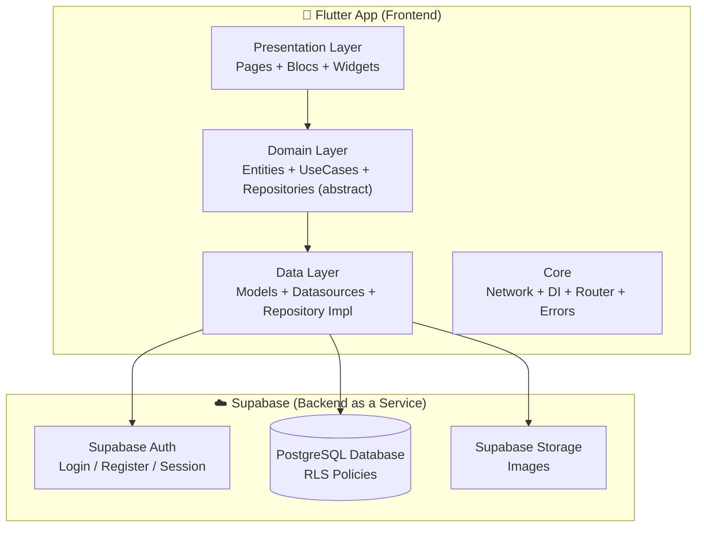

**FLUX D'AUTHENTIFICATION :** `Flutter → Supabase Auth (JWT) → SecureStorage`
**FLUX DONNÉES :** `Flutter → Supabase SDK (postgrest) → PostgreSQL`

---

## 3. DIAGRAMME DE L'ARCHITECTURE FLUTTER (CLEAN ARCHITECTURE)

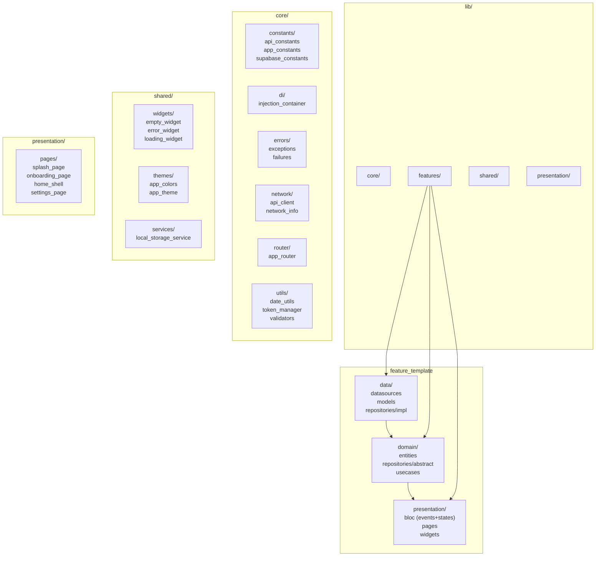

### Structure des features (7 modules)

```
lib/features/
├── auth/           ← Authentification (Login, Register, Forgot Password, Logout)
├── events/         ← Événements (CRUD, liste, détail, gestion, dashboard)
├── bookings/       ← Réservations (création, historique)
├── tickets/        ← Billets (liste, QR code, scanner)
├── payments/       ← Paiements (Stripe intent, confirmation)
├── notifications/  ← Notifications (liste)
└── profile/        ← Profil (affichage, édition)
```

---

## 4. DIAGRAMME ENTITÉ-RELATION (FLUTTER)

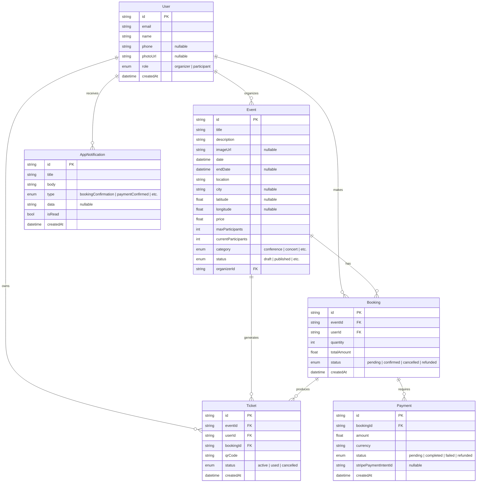

---

## 5. DIAGRAMME DE CLASSES UML — FRONTEND (FLUTTER)


---

## 6. MODÈLE CONCEPTUEL DE DONNÉES (MCD)


### Légende du MCD

| Symbole | Signification |
|---------|---------------|
| `||--o{` | 1 → N (un à plusieurs) |
| `id PK` | Clé primaire |
| `FK` | Clé étrangère |
| `?` | Optionnel (nullable) |

### Règles de gestion

| Règle | Description |
|-------|-------------|
| RG01 | Un **Utilisateur** ne peut avoir qu'un seul **Profil** |
| RG02 | Un **Utilisateur** peut organiser 0 ou plusieurs **Événements** |
| RG03 | Un **Utilisateur** peut effectuer 0 ou plusieurs **Réservations** |
| RG04 | Un **Utilisateur** peut posséder 0 ou plusieurs **Tickets** |
| RG05 | Un **Utilisateur** peut recevoir 0 ou plusieurs **Notifications** |
| RG06 | Une **Catégorie** peut classer 0 ou plusieurs **Événements** |
| RG07 | Un **Événement** peut avoir 0 ou plusieurs **Réservations** |
| RG08 | Un **Événement** peut générer 0 ou plusieurs **Tickets** |
| RG09 | Une **Réservation** nécessite 0 ou 1 **Paiement** |
| RG10 | Une **Réservation** produit 0 ou plusieurs **Tickets** |
| RG11 | Un **Ticket** ne peut être scanné qu'une seule fois (statut → USED) |
| RG12 | Un **Paiement** est obligatoire pour les événements payants (prix > 0) |
| RG13 | Un **Utilisateur** de rôle `organisateur` peut créer/modifier/supprimer ses événements |
| RG14 | Un **Utilisateur** de rôle `participant` peut réserver et annuler ses réservations |

---

## 7. DIAGRAMME DE NAVIGATION (GO ROUTER)

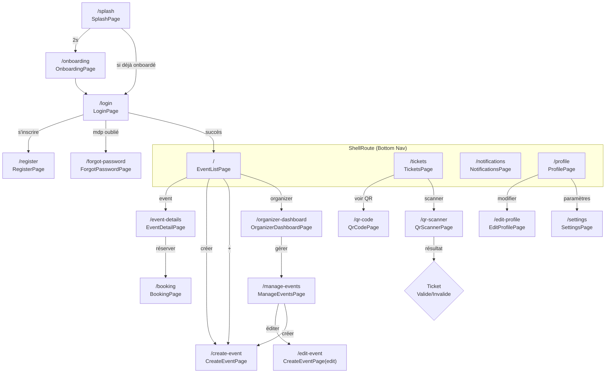

### Protection des routes

| Condition | Redirection |
|-----------|-------------|
| Non authentifié → route protégée | → `/login` |
| Authentifié → `/login`, `/register`, `/forgot-password`, `/splash`, `/onboarding` | → `/` |
| Sinon | Route demandée |

---

## 8. DIAGRAMME DE SÉQUENCE — FLUX D'AUTHENTIFICATION

> **Backend :** Supabase Auth (JWT) — pas de serveur Spring Boot

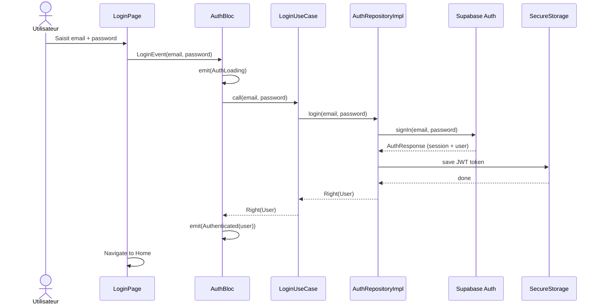

---

## 9. DIAGRAMME DE SÉQUENCE — FLUX QR CODE

> **Backend :** Supabase PostgreSQL (table `tickets`) — pas de serveur Spring Boot

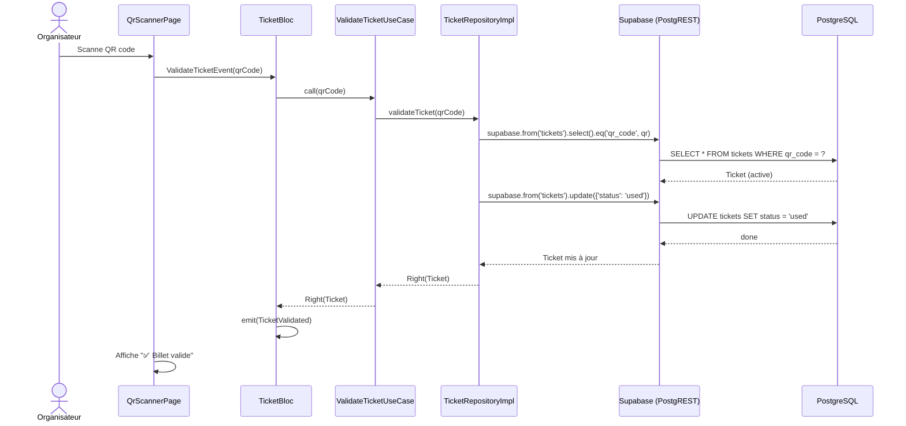

---

## 10. DIAGRAMME DE DÉPLOIEMENT

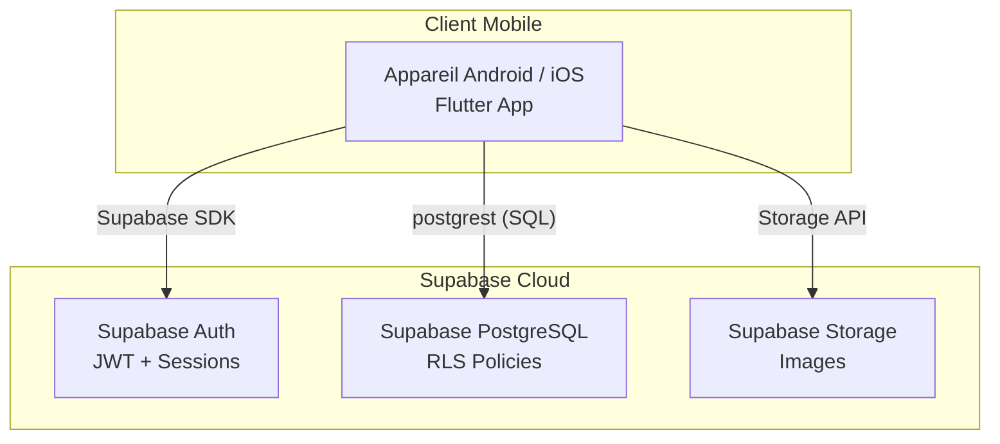

---

## 11. TABLEAUX DES ENDPOINTS API

> **Note :** Le projet utilise Supabase comme unique backend. Les endpoints ci-dessous sont fournis à titre de référence pour une éventuelle API REST mais ne sont pas implémentés dans le code actuel.

### Authentification

| Méthode | Path | Auth | Body | Réponse |
|---------|------|------|------|---------|
| `POST` | `/api/auth/register` | ❌ | `RegisterRequest` | `201` → `AuthResponse` (JWT + user) |
| `POST` | `/api/auth/login` | ❌ | `LoginRequest` | `200` → `AuthResponse` (JWT + user) |

### Catégories

| Méthode | Path | Auth | Body | Réponse |
|---------|------|------|------|---------|
| `GET` | `/api/categories` | ✅ | — | `200` → `List<Category>` |
| `POST` | `/api/categories` | ✅ | `CategoryRequest` | `201` → `Category` |

### Événements

| Méthode | Path | Rôle | Body | Réponse |
|---------|------|------|------|---------|
| `GET` | `/api/events` | ✅ Auth any | — | `200` → `List<EventResponse>` |
| `GET` | `/api/events/{id}` | ✅ Auth any | — | `200` → `EventResponse` |
| `POST` | `/api/events` | 🔒 ORGANIZER | `EventRequest` | `201` → `EventResponse` |
| `PUT` | `/api/events/{id}` | 🔒 ORGANIZER (owner) | `EventRequest` | `200` → `EventResponse` |
| `DELETE` | `/api/events/{id}` | 🔒 ORGANIZER (owner) | — | `204` No Content |

### Invitations (QR Code)

| Méthode | Path | Auth | Body | Réponse |
|---------|------|------|------|---------|
| `POST` | `/api/invitations` | ✅ | `InvitationRequest` | `201` → `InvitationResponse` |
| `GET` | `/api/invitations/my` | ✅ | — | `200` → `List<InvitationResponse>` |
| `POST` | `/api/invitations/verify` | ✅ | `QrVerifyRequest` | `200` → `{ message, status }` |

---

## 12. SCHÉMA DE LA BASE DE DONNÉES (PostgreSQL — Supabase)

Le schéma complet est défini dans `supabase_schema.sql` à la racine du projet. Il inclut les tables :

- `profiles` — utilisateurs (lié à Supabase Auth)
- `events` — événements avec RLS
- `bookings` — réservations
- `tickets` — billets avec QR codes
- `payments` — paiements
- `notifications` — notifications

Avec politiques Row Level Security (RLS) pour la sécurité au niveau ligne.

---

## 13. STACK TECHNIQUE

### Frontend (Flutter)

| Technologie | Version | Usage |
|-------------|---------|-------|
| Dart SDK | `^3.12.1` | Langage |
| `flutter_bloc` | `^8.1.6` | State management (BLoC pattern) |
| `go_router` | `^14.8.1` | Navigation avec guards |
| `supabase_flutter` | `^2.8.4` | HTTP client + Auth + Database SDK |
| `supabase_flutter` | `^2.8.4` | Auth backend |
| `get_it` | `^8.0.3` | Injection de dépendances |
| `dartz` | `^0.10.1` | Functional (Either pour error handling) |
| `equatable` | `^2.0.7` | Value equality |
| `json_annotation` | `^4.9.0` | JSON serialization |
| `flutter_secure_storage` | `^9.2.4` | Stockage sécurisé JWT |
| `connectivity_plus` | `^6.1.2` | Vérification réseau |
| `qr_flutter` | `^4.1.0` | Génération QR code |
| `mobile_scanner` | `^6.0.6` | Scanner QR code (caméra) |
| `image_picker` | `^1.1.2` | Sélection photo |
| `cached_network_image` | `^3.4.1` | Cache images réseau |
| `lottie` | `^3.3.1` | Animations Lottie |
| `shimmer` | `^3.0.0` | Effet de chargement |
| `flutter_localizations` | SDK | Internationalisation |
| `intl` | `^0.20.2` | i18n + ARB files |
| `flutter_screenutil` | `^5.9.3` | Responsive design |
| `flutter_svg` | `^2.0.17` | SVG rendering |

### Backend

| Technologie | Usage |
|-------------|-------|
| Supabase Auth | Authentification (JWT) |
| Supabase PostgreSQL | Base de données avec Row Level Security |
| Supabase Storage | Stockage d'images |

### Tests

| Technologie | Type | Status |
|-------------|------|--------|
| `flutter_test` | Widget | ✅ |
| `bloc_test` | Bloc | ✅ |
| `mocktail` | Mocking | ✅ |

---

## 14. DIAGRAMME DES ÉTATS BLOC

### AuthBloc

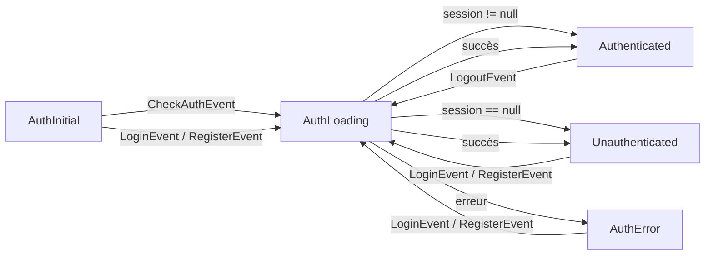

### EventBloc

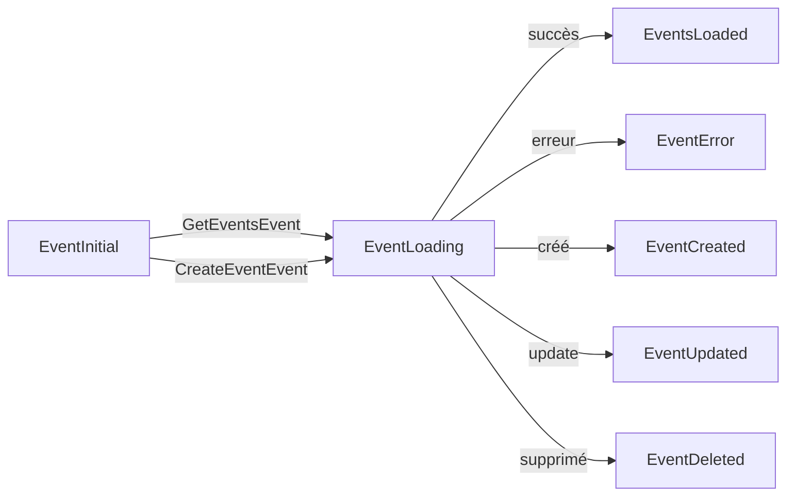

---

## 15. FICHIERS DE TRADUCTION (ARB)

| Clé | Anglais (`app_en.arb`) | Français (`app_fr.arb`) | Arabe (`app_ar.arb`) |
|-----|------------------------|-------------------------|----------------------|
| `app_name` | EventHub | EventHub | إيفنت هب |
| `login` | Login | Connexion | تسجيل الدخول |
| `register` | Register | S'inscrire | إنشاء حساب |
| `email` | Email | Email | البريد الإلكتروني |
| `password` | Password | Mot de passe | كلمة المرور |
| `events` | Events | Événements | الأحداث |
| `tickets` | Tickets | Billets | التذاكر |
| `notifications` | Notifications | Notifications | الإشعارات |
| `profile` | Profile | Profil | الملف الشخصي |
| *(total: 45 clés par langue)* | | | |

---

## 16. SCHÉMA D'INJECTION DE DÉPENDANCES (GetIt)

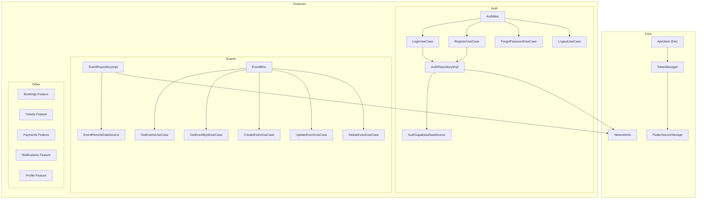

---

## 17. DÉPENDANCES ENTRE PACKAGES (FRONTEND)

```
main.dart
├── supabase_flutter (initialization)
├── get_it (DI container)
└── MultiBlocProvider (7 blocs)

core/
├── constants/       ← api_constants, app_constants, supabase_constants
├── di/              ← injection_container (importe TOUS les blocs/repos/usecases)
├── errors/          ← exceptions, failures (utilisés par toutes les features)
├── network/         ← Supabase client, network_info (connectivity)
├── router/          ← app_router (importe toutes les pages)
└── utils/           ← date_utils, token_manager, validators

features/{feature}/
├── data/
│   ├── datasources/ ← Appelle Supabase (via supabase_flutter SDK)
│   ├── models/       ← JSON serialization
│   └── repositories/ ← Implémente l'interface domain
├── domain/
│   ├── entities/     ← Classes métier (extends Equatable)
│   ├── repositories/ ← Interfaces abstraites
│   └── usecases/     ← Appellent le repository
└── presentation/
    ├── bloc/         ← Bloc + Events + States
    ├── pages/        ← Screens Flutter
    └── widgets/      ← Composants réutilisables
```

---

## 18. COUVERTURE DE TESTS

| Feature | Type | Fichier | Tests |
|---------|------|---------|-------|
| ✅ Core | Unitaire | `network_info_test.dart` | 3 |
| ✅ Core | Unitaire | `date_utils_test.dart` | 4 |
| ✅ Core | Unitaire | `token_manager_test.dart` | 4 |
| ✅ Core | Unitaire | `validators_test.dart` | 20+ |
| ✅ Shared | Widget | `empty_widget_test.dart` | 3 |
| ✅ Shared | Widget | `error_widget_test.dart` | 3 |
| ✅ Shared | Widget | `loading_widget_test.dart` | 3 |
| ✅ Auth | Repository | `auth_repository_impl_test.dart` | 8 |
| ✅ Auth | UseCase | `login_usecase_test.dart` | 2 |
| ✅ Auth | UseCase | `register_usecase_test.dart` | 2 |
| ✅ Auth | UseCase | `forgot_password_usecase_test.dart` | 2 |
| ✅ Auth | Bloc | `auth_bloc_test.dart` | 5 |
| ✅ Auth | Widget | `login_page_test.dart` | 6 |
| ✅ Auth | Widget | `register_page_test.dart` | 4 |
| ✅ Auth | Widget | `forgot_password_page_test.dart` | 2 |
| ✅ Auth | Intégration | `login_flow_integration_test.dart` | 4 |
| ✅ Auth | Intégration | `register_flow_integration_test.dart` | 3 |
| ✅ Bookings | Bloc | `booking_bloc_test.dart` | 3 |
| ✅ Events | Bloc | `event_bloc_test.dart` | 5 |
| ✅ Events | Widget | `event_card_test.dart` | 7 |
| ✅ General | Smoke | `widget_test.dart` | 1 |
| ❌ Payments | Bloc | `payment_bloc_test.dart` | **0 test** |
| ❌ Notifications | — | — | **0 test** |
| ❌ Profile | — | — | **0 test** |
| ❌ Admin | — | — | **0 test** |

---

## 19. SCHÉMA DE SÉCURITÉ

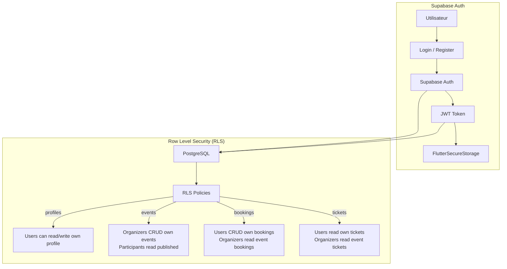

---

## 20. VARIABLES D'ENVIRONNEMENT / CONFIGURATION

```dart
// ===== Frontend (supabase_constants.dart) =====
static const String supabaseUrl = 'https://xxxxx.supabase.co';
static const String anonKey = '...';
```

Les credentials peuvent être passés au build-time :

```bash
flutter run --dart-define=SUPABASE_URL=https://your-project.supabase.co \
            --dart-define=SUPABASE_ANON_KEY=your-anon-key
```

---

## 21. THÈME MATERIAL 3 — PALETTE DE COULEURS

```dart
static const Color primary   = Color(0xFF6C63FF);  // Violet (branding)
static const Color accent    = Color(0xFFFF6B35);  // Orange (CTA)
static const Color white     = Color(0xFFFFFFFF);
static const Color black     = Color(0xFF1A1A2E);  // Texte foncé
static const Color error     = Color(0xFFE53935);  // Rouge erreur
static const Color success   = Color(0xFF4CAF50);  // Vert succès
static const Color warning   = Color(0xFFFFC107);  // Jaune avertissement
static const Color surfaceLight = Color(0xFFF5F5F5);
static const Color surfaceDark  = Color(0xFF121212);
```

---

## 22. OBSERVATIONS ET NOTES

| # | Observation | Détail |
|---|-------------|--------|
| 1 | **Spring Boot supprimé** | Le backend Spring Boot a été retiré du projet. L'architecture est désormais 100% Flutter + Supabase. La documentation a été mise à jour en conséquence. |
| 2 | **QR Codes** | Le frontend utilise `qr_flutter` pour l'affichage et `mobile_scanner` pour le scan. Les QR codes sont stockés en base Supabase. |
| 3 | **Paiements Stripe** | L'architecture est préparée (entité `Payment`, datasource Supabase) mais il n'y a pas d'intégration réelle du SDK Stripe. Les paiements sont simulés via des enregistrements en base. |
| 4 | **Tests** | ~90 tests (bonne couverture auth, events, bookings, shared widgets). Manque : tests pour payments, notifications, profile, admin. |
| 5 | **CI/CD** | Pipeline GitHub Actions présent (`.github/workflows/ci.yml`) : `flutter analyze` + `flutter test`. |
| 6 | **Thème/Langue** | Persistés localement via `SharedPreferences`. Pas de synchro backend (non nécessaire sans compte multi-appareil). |
| 7 | **Dashboard** | Les statistiques de `OrganizerDashboardPage` sont calculées dynamiquement depuis les événements chargés. |
| 8 | **Dépendances** | Plusieurs packages ont des versions majeures disponibles (`go_router`, `get_it`, `mobile_scanner`, etc.). |
