# FICHE D'EXTRACTION — EventHub

> **Plateforme mobile de gestion, découverte et réservation d'événements**
> Architecture : Clean Architecture (Flutter) + Architecture en couches (Spring Boot)

---

## 1. VUE D'ENSEMBLE DU PROJET

```
pi-eventhub/
├── eventhub/                          ← Application Flutter (Frontend Mobile)
│   ├── lib/                           ← Code source Dart
│   ├── test/                          ← Tests (unitaires, widget, intégration)
│   ├── pubspec.yaml                   ← Dépendances Flutter
│   ├── assets/                        ← Images, Lottie, Icônes
│   └── l10n/                          ← Fichiers de traduction (ARB)
│
├── src/                               ← API REST Spring Boot (Backend)
│   └── main/
│       ├── java/com/eventhub/         ← Code source Java
│       └── resources/                 ← Configuration (application.properties)
│
├── pom.xml                            ← Dépendances Maven
└── FICHE_EXTRACTION_EVENTHUB.md       ← Ce document
```

---

## 2. DIAGRAMME DE L'ARCHITECTURE GLOBALE

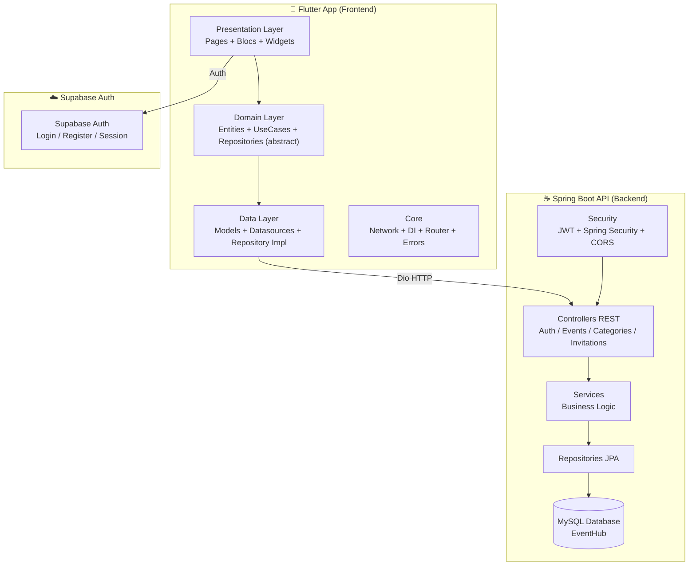

**FLUX D'AUTHENTIFICATION :** `Flutter → Supabase Auth (JWT) → SecureStorage`
**FLUX API :** `Flutter → Spring Boot REST (Dio + JWT Bearer) → MySQL`

---

## 3. DIAGRAMME DE L'ARCHITECTURE FLUTTER (CLEAN ARCHITECTURE)

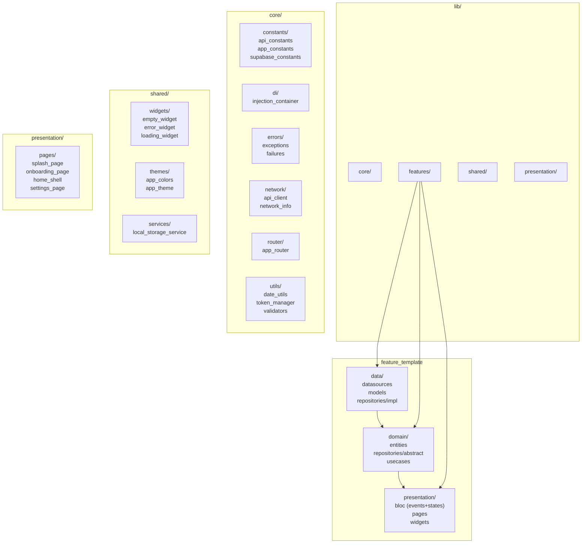

### Structure des features (7 modules)

```
lib/features/
├── auth/           ← Authentification (Login, Register, Forgot Password, Logout)
├── events/         ← Événements (CRUD, liste, détail, gestion, dashboard)
├── bookings/       ← Réservations (création, historique)
├── tickets/        ← Billets (liste, QR code, scanner)
├── payments/       ← Paiements (Stripe intent, confirmation)
├── notifications/  ← Notifications (liste)
└── profile/        ← Profil (affichage, édition)
```

---

## 4. DIAGRAMME DE L'ARCHITECTURE SPRING BOOT

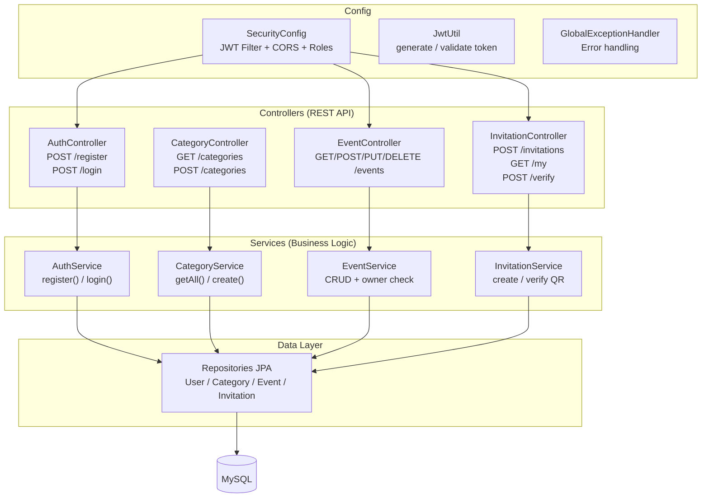

---

## 5. DIAGRAMME ENTITÉ-RELATION (BACKEND — SPRING BOOT)

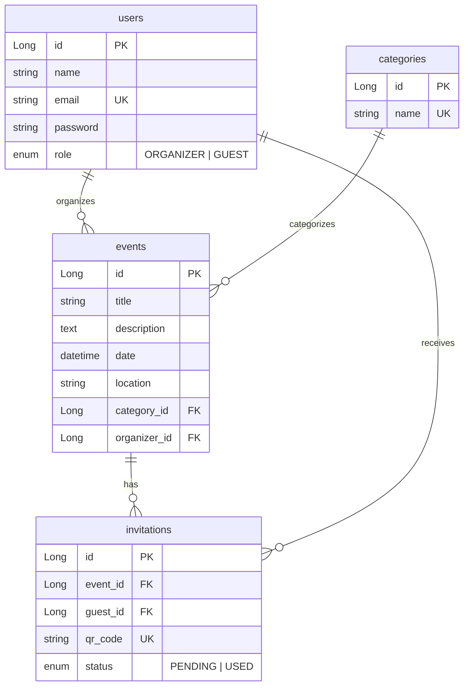

### Relations JPA

| Entité | Relation | Cible | Fetch | Contrainte |
|--------|----------|-------|-------|------------|
| `Event` → `Category` | `@ManyToOne` | `category` | LAZY | `category_id` nullable |
| `Event` → `User` | `@ManyToOne` | `organizer` | LAZY | `organizer_id` NOT NULL |
| `Invitation` → `Event` | `@ManyToOne` | `event` | LAZY | `event_id` NOT NULL |
| `Invitation` → `User` | `@ManyToOne` | `guest` | LAZY | `guest_id` NOT NULL |

---

## 6. DIAGRAMME ENTITÉ-RELATION (FRONTEND — FLUTTER)


---

## 7. DIAGRAMME DE CLASSES UML — BACKEND (SPRING BOOT)

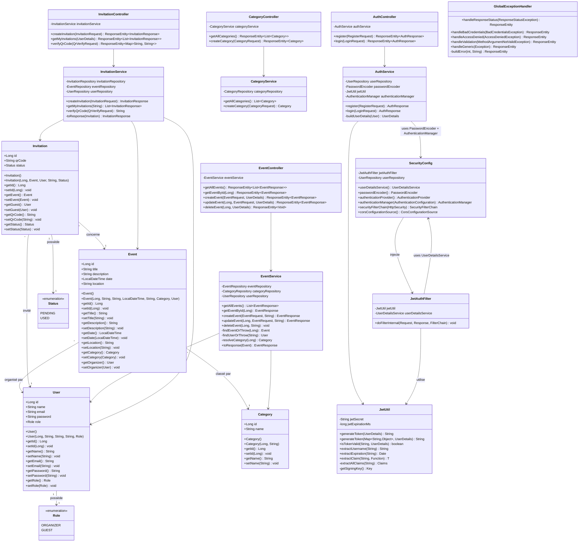

---

## 8. DIAGRAMME DE CLASSES UML — FRONTEND (FLUTTER)

```mermaid
classDiagram
    %% ── Core ────────────────────────────────────────────────
    class ApiConstants {
        <<static>>
        +String baseUrl
        +String auth
        +String login
        +String register
        +String events
        +String bookings
        +String tickets
        +String payments
        +String notifications
        +Duration connectTimeout
        +Duration receiveTimeout
    }

    class AppConstants {
        <<static>>
        +String localeKey
        +String themeModeKey
        +String jwtTokenKey
        +String onboardingKey
        +int minPasswordLength
        +int maxEventTitle
        +int maxEventDescription
        +int pageSize
    }

    class TokenManager {
        -FlutterSecureStorage storage
        +saveToken(String) Future~void~
        +getToken() Future~String?~
        +saveRefreshToken(String) Future~void~
        +getRefreshToken() Future~String?~
        +clearTokens() Future~void~
    }

    class ApiClient {
        -Dio dio
        -TokenManager tokenManager
        +get(String, Map?) Future~Response~
        +post(String, dynamic) Future~Response~
        +put(String, dynamic) Future~Response~
        +delete(String) Future~Response~
    }

    class NetworkInfo {
        <<abstract>>
        +isConnected() Future~bool~
    }
    class NetworkInfoImpl {
        -Connectivity connectivity
        +isConnected() Future~bool~
    }

    %% ── Failures ────────────────────────────────────────────
    class Failure {
        <<abstract>>
        +String message
    }
    class ServerFailure
    class CacheFailure
    class NetworkFailure
    class AuthFailure
    class ValidationFailure

    %% ── Domain Entities ─────────────────────────────────────
    class User {
        +String id
        +String email
        +String name
        +String? phone
        +String? photoUrl
        +UserRole role
        +DateTime? createdAt
    }
    class UserRole {
        <<enumeration>>
        organizer
        participant
    }

    class Event {
        +String id
        +String title
        +String description
        +String? imageUrl
        +DateTime date
        +DateTime? endDate
        +String location
        +String? city
        +double? lat/lng
        +double price
        +int maxParticipants
        +int currentParticipants
        +EventCategory category
        +EventStatus status
        +String organizerId
        +String? organizerName
        +DateTime? createdAt
        +DateTime? updatedAt
        +isFree() bool
        +isFull() bool
        +isPast() bool
    }
    class EventCategory {
        <<enumeration>>
        conference, concert, exhibition
        training, workshop, sports
        seminar, community
    }
    class EventStatus {
        <<enumeration>>
        draft, published
        cancelled, completed
    }

    class Booking {
        +String id
        +String eventId
        +String userId
        +String? eventTitle
        +String? eventImageUrl
        +DateTime? eventDate
        +String? eventLocation
        +int quantity
        +double totalAmount
        +BookingStatus status
        +DateTime? createdAt
    }
    class BookingStatus {
        <<enumeration>>
        pending, confirmed
        cancelled, refunded
    }

    class Ticket {
        +String id
        +String eventId
        +String userId
        +String bookingId
        +String? eventTitle
        +String? eventDate
        +String? eventLocation
        +String qrCode
        +TicketStatus status
        +DateTime? createdAt
    }
    class TicketStatus {
        <<enumeration>>
        active, used, cancelled
    }

    class Payment {
        +String id
        +String bookingId
        +double amount
        +String currency
        +PaymentStatus status
        +String? stripePaymentIntentId
        +DateTime? createdAt
    }
    class PaymentStatus {
        <<enumeration>>
        pending, completed
        failed, refunded
    }

    class AppNotification {
        +String id
        +String title
        +String body
        +NotificationType type
        +String? data
        +bool isRead
        +DateTime? createdAt
    }
    class NotificationType {
        <<enumeration>>
        bookingConfirmation, paymentConfirmed
        eventCancelled, eventReminder, general
    }

    class Profile {
        +String id
        +String email
        +String name
        +String? phone
        +String? photoUrl
        +UserRole role
        +DateTime? createdAt
    }

    %% ── Repository Interfaces ───────────────────────────────
    class AuthRepository {
        <<abstract>>
        +login(String, String) Future~Either~Failure, User~~
        +register(String, String, String, String) Future~Either~Failure, User~~
        +forgotPassword(String) Future~Either~Failure, void~~
        +logout() Future~Either~Failure, void~~
    }

    class EventRepository {
        <<abstract>>
        +getEvents(int, int, String?, String?, double?, double?, DateTime?) Future~Either~Failure, List~Event~~~
        +getEventById(String) Future~Either~Failure, Event~~
        +createEvent(Event) Future~Either~Failure, Event~~
        +updateEvent(Event) Future~Either~Failure, Event~~
        +deleteEvent(String) Future~Either~Failure, void~~
    }

    class BookingRepository {
        <<abstract>>
        +createBooking(Booking) Future~Either~Failure, Booking~~
        +getUserBookings(String) Future~Either~Failure, List~Booking~~
    }

    class TicketRepository {
        <<abstract>>
        +getUserTickets(String) Future~Either~Failure, List~Ticket~~
        +validateTicket(String) Future~Either~Failure, Ticket~~
    }

    class PaymentRepository {
        <<abstract>>
        +createPaymentIntent(double, String) Future~Either~Failure, String~~
        +confirmPayment(String) Future~Either~Failure, Payment~~
    }

    class NotificationRepository {
        <<abstract>>
        +getNotifications(String) Future~Either~Failure, List~AppNotification~~
    }

    %% ── BLoCs ───────────────────────────────────────────────
    class AuthBloc {
        +LoginUseCase loginUseCase
        +RegisterUseCase registerUseCase
        +ForgotPasswordUseCase forgotPasswordUseCase
        +LogoutUseCase logoutUseCase
        +_onLogin(LoginEvent, Emitter) void
        +_onRegister(RegisterEvent, Emitter) void
        +_onForgotPassword(ForgotPasswordEvent, Emitter) void
        +_onLogout(LogoutEvent, Emitter) void
        +_onCheckAuth(CheckAuthEvent, Emitter) void
    }

    class EventBloc {
        +GetEventsUseCase getEventsUseCase
        +GetEventByIdUseCase getEventByIdUseCase
        +CreateEventUseCase createEventUseCase
        +UpdateEventUseCase updateEventUseCase
        +DeleteEventUseCase deleteEventUseCase
    }

    class BookingBloc {
        +CreateBookingUseCase createBookingUseCase
        +GetUserBookingsUseCase getUserBookingsUseCase
    }

    class TicketBloc {
        +GetUserTicketsUseCase getUserTicketsUseCase
        +ValidateTicketUseCase validateTicketUseCase
    }

    class PaymentBloc {
        +CreatePaymentIntentUseCase createPaymentIntentUseCase
        +ConfirmPaymentUseCase confirmPaymentUseCase
    }

    class NotificationBloc {
        +GetNotificationsUseCase getNotificationsUseCase
    }

    class ProfileBloc {
        +GetProfileUseCase getProfileUseCase
        +UpdateProfileUseCase updateProfileUseCase
    }

    %% ── Use Cases ───────────────────────────────────────────
    class LoginUseCase {
        +call(String, String) Future~Either~Failure, User~~
    }
    class RegisterUseCase {
        +call(String, String, String, String) Future~Either~Failure, User~~
    }
    class CreateEventUseCase {
        +call(Event) Future~Either~Failure, Event~~
    }
    class ValidateTicketUseCase {
        +call(String) Future~Either~Failure, Ticket~~
    }

    %% ── Relations ───────────────────────────────────────────
    NetworkInfoImpl ..|> NetworkInfo
    Failure <|-- ServerFailure
    Failure <|-- CacheFailure
    Failure <|-- NetworkFailure
    Failure <|-- AuthFailure
    Failure <|-- ValidationFailure

    User --> UserRole
    Event --> EventCategory
    Event --> EventStatus
    Booking --> BookingStatus
    Ticket --> TicketStatus
    Payment --> PaymentStatus
    AppNotification --> NotificationType
    Profile --> UserRole

    AuthBloc --> LoginUseCase
    AuthBloc --> RegisterUseCase
    AuthBloc --> ForgotPasswordUseCase
    AuthBloc --> LogoutUseCase
    EventBloc --> GetEventByIdUseCase
    EventBloc --> GetEventsUseCase
    EventBloc --> CreateEventUseCase
    EventBloc --> UpdateEventUseCase
    EventBloc --> DeleteEventUseCase
    BookingBloc --> CreateBookingUseCase
    BookingBloc --> GetUserBookingsUseCase
    TicketBloc --> ValidateTicketUseCase
    TicketBloc --> GetUserTicketsUseCase
    PaymentBloc --> CreatePaymentIntentUseCase
    PaymentBloc --> ConfirmPaymentUseCase

    LoginUseCase --> AuthRepository
    RegisterUseCase --> AuthRepository
    CreateEventUseCase --> EventRepository
    ValidateTicketUseCase --> TicketRepository
```

---

## 9. MODÈLE CONCEPTUEL DE DONNÉES (MCD)

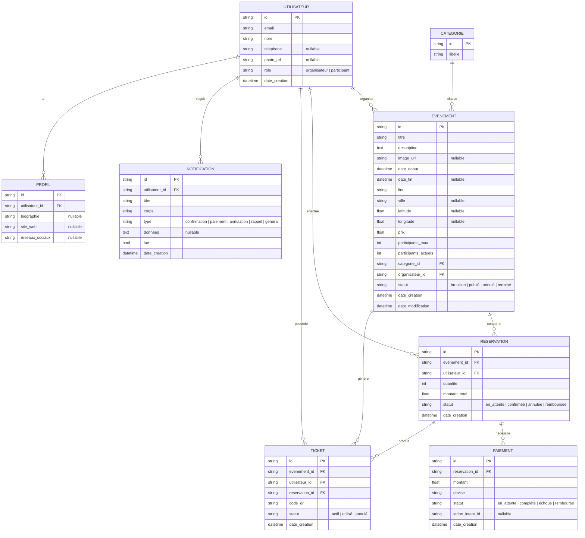

### Légende du MCD

| Symbole | Signification |
|---------|---------------|
| `||--o{` | 1 → N (un à plusieurs) |
| `id PK` | Clé primaire |
| `FK` | Clé étrangère |
| `?` | Optionnel (nullable) |

### Règles de gestion

| Règle | Description |
|-------|-------------|
| RG01 | Un **Utilisateur** ne peut avoir qu'un seul **Profil** |
| RG02 | Un **Utilisateur** peut organiser 0 ou plusieurs **Événements** |
| RG03 | Un **Utilisateur** peut effectuer 0 ou plusieurs **Réservations** |
| RG04 | Un **Utilisateur** peut posséder 0 ou plusieurs **Tickets** |
| RG05 | Un **Utilisateur** peut recevoir 0 ou plusieurs **Notifications** |
| RG06 | Une **Catégorie** peut classer 0 ou plusieurs **Événements** |
| RG07 | Un **Événement** peut avoir 0 ou plusieurs **Réservations** |
| RG08 | Un **Événement** peut générer 0 ou plusieurs **Tickets** |
| RG09 | Une **Réservation** nécessite 0 ou 1 **Paiement** |
| RG10 | Une **Réservation** produit 0 ou plusieurs **Tickets** |
| RG11 | Un **Ticket** ne peut être scanné qu'une seule fois (statut → USED) |
| RG12 | Un **Paiement** est obligatoire pour les événements payants (prix > 0) |
| RG13 | Un **Utilisateur** de rôle `organisateur` peut créer/modifier/supprimer ses événements |
| RG14 | Un **Utilisateur** de rôle `participant` peut réserver et annuler ses réservations |

---

## 10. DIAGRAMME DE NAVIGATION (GO ROUTER)

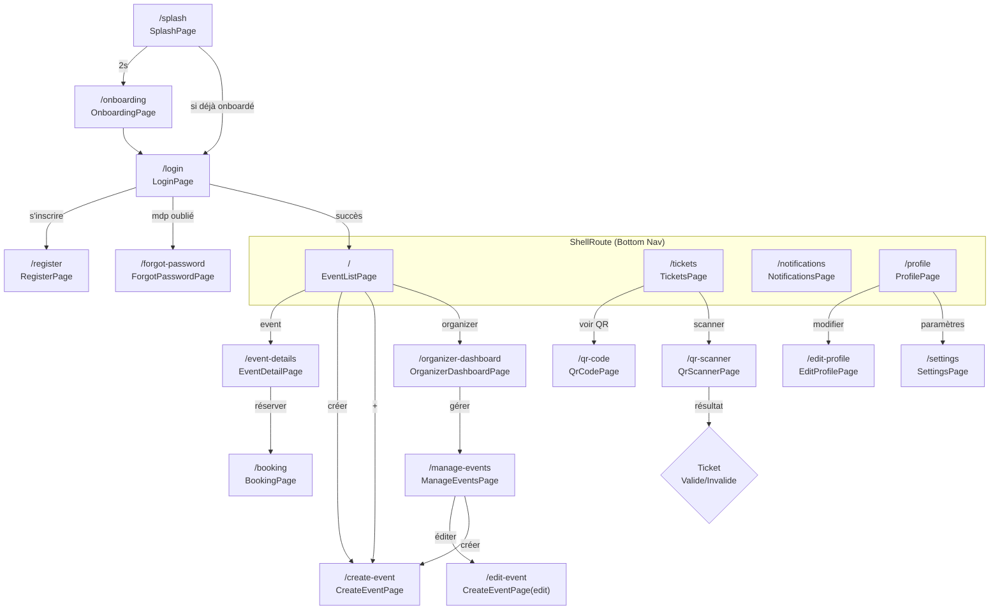

### Protection des routes

| Condition | Redirection |
|-----------|-------------|
| Non authentifié → route protégée | → `/login` |
| Authentifié → `/login`, `/register`, `/forgot-password`, `/splash`, `/onboarding` | → `/` |
| Sinon | Route demandée |

---

## 8. DIAGRAMME DE SÉQUENCE — FLUX D'AUTHENTIFICATION

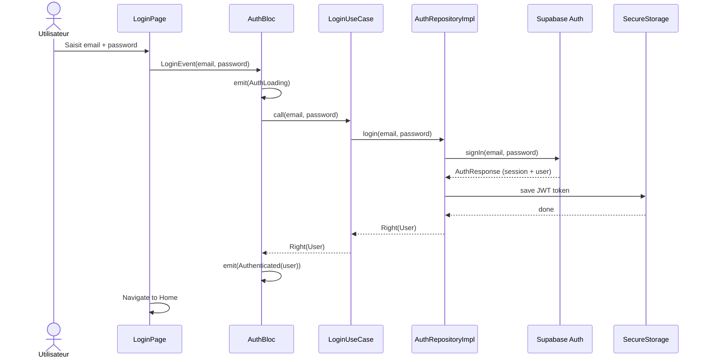

---

## 9. DIAGRAMME DE SÉQUENCE — FLUX QR CODE

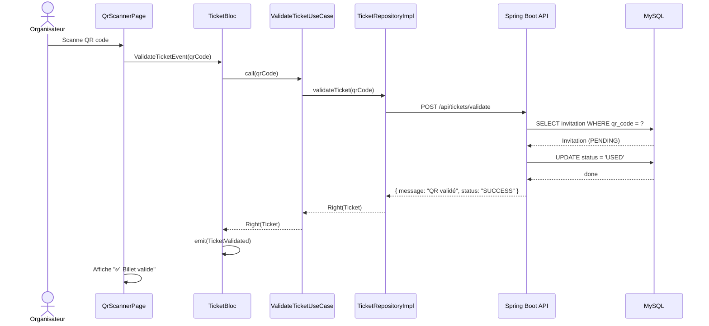

---

## 11. DIAGRAMME DE DÉPLOIEMENT

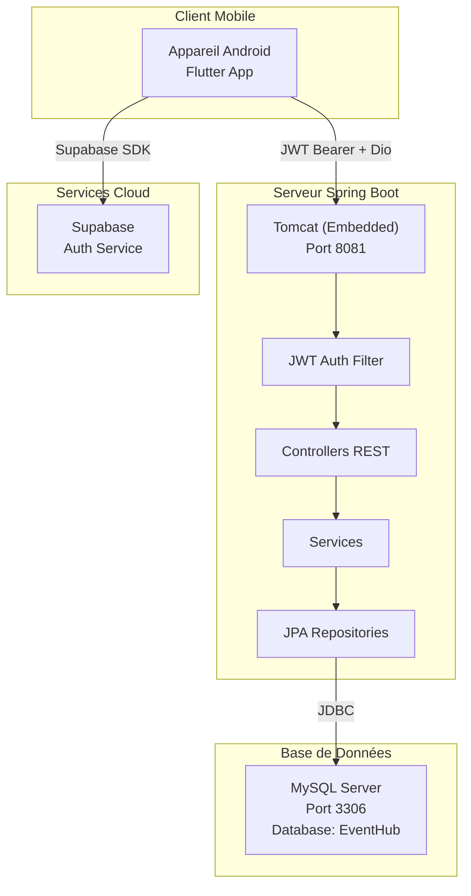

---

## 12. TABLEAUX DES ENDPOINTS API

### Authentification

| Méthode | Path | Auth | Body | Réponse |
|---------|------|------|------|---------|
| `POST` | `/api/auth/register` | ❌ | `RegisterRequest` | `201` → `AuthResponse` (JWT + user) |
| `POST` | `/api/auth/login` | ❌ | `LoginRequest` | `200` → `AuthResponse` (JWT + user) |

### Catégories

| Méthode | Path | Auth | Body | Réponse |
|---------|------|------|------|---------|
| `GET` | `/api/categories` | ✅ | — | `200` → `List<Category>` |
| `POST` | `/api/categories` | ✅ | `CategoryRequest` | `201` → `Category` |

### Événements

| Méthode | Path | Rôle | Body | Réponse |
|---------|------|------|------|---------|
| `GET` | `/api/events` | ✅ Auth any | — | `200` → `List<EventResponse>` |
| `GET` | `/api/events/{id}` | ✅ Auth any | — | `200` → `EventResponse` |
| `POST` | `/api/events` | 🔒 ORGANIZER | `EventRequest` | `201` → `EventResponse` |
| `PUT` | `/api/events/{id}` | 🔒 ORGANIZER (owner) | `EventRequest` | `200` → `EventResponse` |
| `DELETE` | `/api/events/{id}` | 🔒 ORGANIZER (owner) | — | `204` No Content |

### Invitations (QR Code)

| Méthode | Path | Auth | Body | Réponse |
|---------|------|------|------|---------|
| `POST` | `/api/invitations` | ✅ | `InvitationRequest` | `201` → `InvitationResponse` |
| `GET` | `/api/invitations/my` | ✅ | — | `200` → `List<InvitationResponse>` |
| `POST` | `/api/invitations/verify` | ✅ | `QrVerifyRequest` | `200` → `{ message, status }` |

---

## 13. SCHÉMA DE LA BASE DE DONNÉES (MySQL)

```sql
CREATE TABLE users (
    id      BIGINT AUTO_INCREMENT PRIMARY KEY,
    name    VARCHAR(255) NOT NULL,
    email   VARCHAR(255) NOT NULL UNIQUE,
    password VARCHAR(255) NOT NULL,
    role    ENUM('ORGANIZER', 'GUEST') NOT NULL
);

CREATE TABLE categories (
    id   BIGINT AUTO_INCREMENT PRIMARY KEY,
    name VARCHAR(255) NOT NULL UNIQUE
);

CREATE TABLE events (
    id           BIGINT AUTO_INCREMENT PRIMARY KEY,
    title        VARCHAR(255) NOT NULL,
    description  TEXT,
    date         DATETIME NOT NULL,
    location     VARCHAR(255) NOT NULL,
    category_id  BIGINT,
    organizer_id BIGINT NOT NULL,
    FOREIGN KEY (category_id)  REFERENCES categories(id),
    FOREIGN KEY (organizer_id) REFERENCES users(id)
);

CREATE TABLE invitations (
    id       BIGINT AUTO_INCREMENT PRIMARY KEY,
    event_id BIGINT NOT NULL,
    guest_id BIGINT NOT NULL,
    qr_code  VARCHAR(255) NOT NULL UNIQUE,
    status   ENUM('PENDING', 'USED') NOT NULL,
    FOREIGN KEY (event_id) REFERENCES events(id),
    FOREIGN KEY (guest_id) REFERENCES users(id)
);
```

---

## 14. STACK TECHNIQUE

### Frontend (Flutter)

| Technologie | Version | Usage |
|-------------|---------|-------|
| Dart SDK | `^3.12.1` | Langage |
| `flutter_bloc` | `^8.1.6` | State management (BLoC pattern) |
| `go_router` | `^14.8.1` | Navigation avec guards |
| `dio` | `^5.7.0` | HTTP client (JWT interceptor) |
| `supabase_flutter` | `^2.8.4` | Auth backend |
| `get_it` | `^8.0.3` | Injection de dépendances |
| `dartz` | `^0.10.1` | Functional (Either pour error handling) |
| `equatable` | `^2.0.7` | Value equality |
| `json_annotation` | `^4.9.0` | JSON serialization |
| `flutter_secure_storage` | `^9.2.4` | Stockage sécurisé JWT |
| `connectivity_plus` | `^6.1.2` | Vérification réseau |
| `qr_flutter` | `^4.1.0` | Génération QR code |
| `mobile_scanner` | `^6.0.6` | Scanner QR code (caméra) |
| `image_picker` | `^1.1.2` | Sélection photo |
| `cached_network_image` | `^3.4.1` | Cache images réseau |
| `lottie` | `^3.3.1` | Animations Lottie |
| `shimmer` | `^3.0.0` | Effet de chargement |
| `flutter_localizations` | SDK | Internationalisation |
| `intl` | `^0.20.2` | i18n + ARB files |
| `flutter_screenutil` | `^5.9.3` | Responsive design |
| `flutter_svg` | `^2.0.17` | SVG rendering |

### Backend (Spring Boot)

| Technologie | Version | Usage |
|-------------|---------|-------|
| Java | 21 | Langage |
| Spring Boot | `3.2.5` | Framework |
| Spring Security | — | Authentification + autorisation |
| Spring Data JPA | — | ORM / Hibernate |
| Spring Validation | — | Validation des DTOs |
| MySQL Connector | — | Driver JDBC |
| JJWT | `0.11.5` | JWT (HMAC-SHA256) |
| ZXing | `3.5.3` | QR Code (non utilisé dans le code actuel) |
| Lombok | `1.18.46` | Boilerplate reduction |

### Tests

| Technologie | Type | Backend | Frontend |
|-------------|------|---------|----------|
| JUnit + Spring Test | Unitaire + Intégration | ❌ Aucun | — |
| `flutter_test` | Widget | — | ✅ |
| `bloc_test` | Bloc | — | ✅ |
| `mocktail` | Mocking | — | ✅ |

---

## 15. DIAGRAMME DES ÉTATS BLOC

### AuthBloc

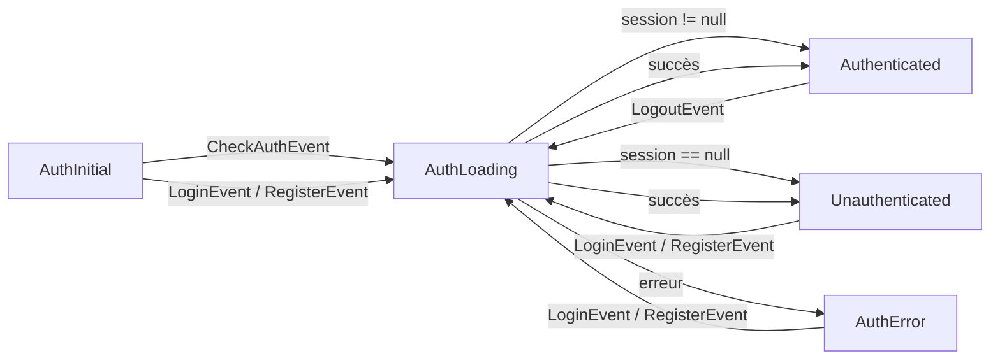

### EventBloc

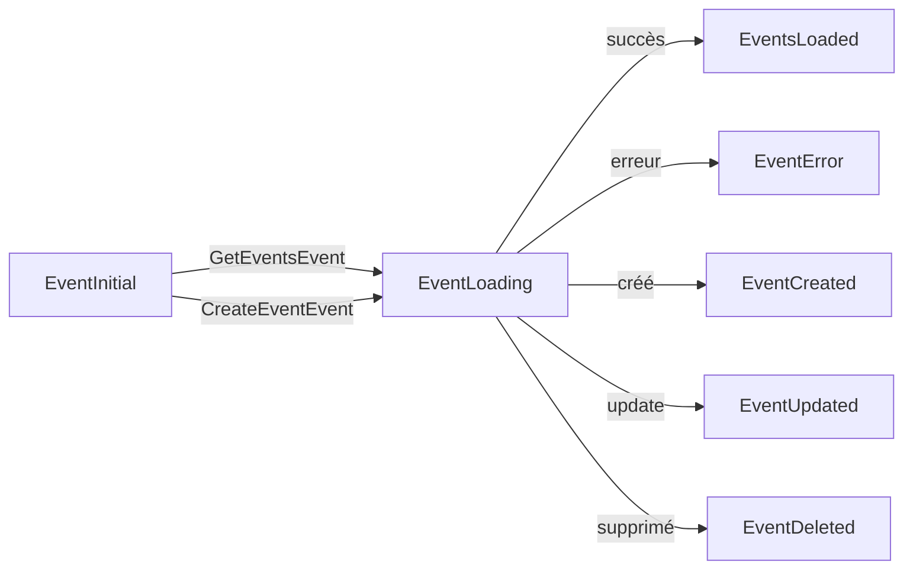

---

## 16. FICHIERS DE TRADUCTION (ARB)

| Clé | Anglais (`app_en.arb`) | Français (`app_fr.arb`) | Arabe (`app_ar.arb`) |
|-----|------------------------|-------------------------|----------------------|
| `app_name` | EventHub | EventHub | إيفنت هب |
| `login` | Login | Connexion | تسجيل الدخول |
| `register` | Register | S'inscrire | إنشاء حساب |
| `email` | Email | Email | البريد الإلكتروني |
| `password` | Password | Mot de passe | كلمة المرور |
| `events` | Events | Événements | الأحداث |
| `tickets` | Tickets | Billets | التذاكر |
| `notifications` | Notifications | Notifications | الإشعارات |
| `profile` | Profile | Profil | الملف الشخصي |
| *(total: 45 clés par langue)* | | | |

---

## 17. SCHÉMA D'INJECTION DE DÉPENDANCES (GetIt)

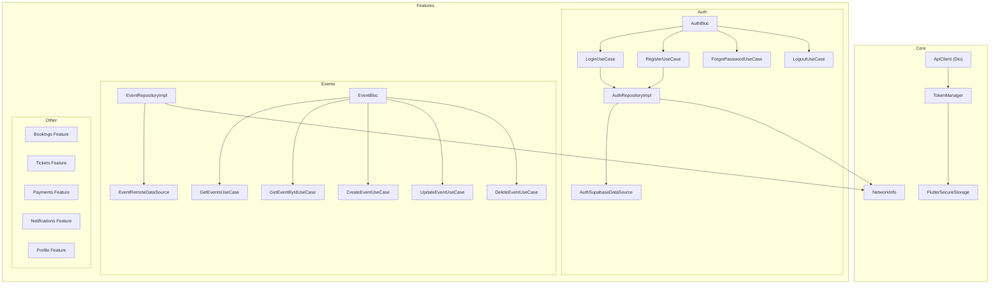

---

## 18. DÉPENDANCES ENTRE PACKAGES (FRONTEND)

```
main.dart
├── supabase_flutter (initialization)
├── get_it (DI container)
└── MultiBlocProvider (7 blocs)

core/
├── constants/       ← api_constants, app_constants, supabase_constants
├── di/              ← injection_container (importe TOUS les blocs/repos/usecases)
├── errors/          ← exceptions, failures (utilisés par toutes les features)
├── network/         ← api_client (Dio), network_info (connectivity)
├── router/          ← app_router (importe toutes les pages)
└── utils/           ← date_utils, token_manager, validators

features/{feature}/
├── data/
│   ├── datasources/ ← Appelle soit api_client, soit supabase
│   ├── models/       ← JSON serialization
│   └── repositories/ ← Implémente l'interface domain
├── domain/
│   ├── entities/     ← Classes métier (extends Equatable)
│   ├── repositories/ ← Interfaces abstraites
│   └── usecases/     ← Appellent le repository
└── presentation/
    ├── bloc/         ← Bloc + Events + States
    ├── pages/        ← Screens Flutter
    └── widgets/      ← Composants réutilisables
```

---

## 19. COUVERTURE DE TESTS

| Feature | Type | Fichier | Tests |
|---------|------|---------|-------|
| ✅ Core | Unitaire | `network_info_test.dart` | 3 |
| ✅ Core | Unitaire | `date_utils_test.dart` | 4 |
| ✅ Core | Unitaire | `token_manager_test.dart` | 4 |
| ✅ Core | Unitaire | `validators_test.dart` | 20+ |
| ✅ Shared | Widget | `empty_widget_test.dart` | 3 |
| ✅ Shared | Widget | `error_widget_test.dart` | 3 |
| ✅ Shared | Widget | `loading_widget_test.dart` | 3 |
| ✅ Auth | Repository | `auth_repository_impl_test.dart` | 8 |
| ✅ Auth | UseCase | `login_usecase_test.dart` | 2 |
| ✅ Auth | UseCase | `register_usecase_test.dart` | 2 |
| ✅ Auth | UseCase | `forgot_password_usecase_test.dart` | 2 |
| ✅ Auth | Bloc | `auth_bloc_test.dart` | 5 |
| ✅ Auth | Widget | `login_page_test.dart` | 6 |
| ✅ Auth | Widget | `register_page_test.dart` | 4 |
| ✅ Auth | Widget | `forgot_password_page_test.dart` | 2 |
| ✅ Auth | Intégration | `login_flow_integration_test.dart` | 4 |
| ✅ Auth | Intégration | `register_flow_integration_test.dart` | 3 |
| ✅ Bookings | Bloc | `booking_bloc_test.dart` | 3 |
| ✅ Events | Bloc | `event_bloc_test.dart` | 5 |
| ✅ Events | Widget | `event_card_test.dart` | 7 |
| ✅ General | Smoke | `widget_test.dart` | 1 |
| ❌ Backend | — | `src/test/` | **0 test** |

---

## 20. SCHÉMA DE SÉCURITÉ

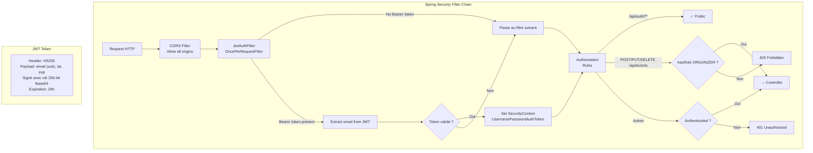

---

## 21. VARIABLES D'ENVIRONNEMENT / CONFIGURATION

```properties
# ===== Backend (application.properties) =====
server.port=8081
spring.datasource.url=jdbc:mysql://localhost:3306/EventHub
spring.datasource.username=spring
spring.datasource.password=spring
spring.jpa.hibernate.ddl-auto=update
app.jwt.secret=404E635266556A586E3272357538782F413F4428472B4B6250645367566B5970
app.jwt.expiration-ms=86400000
```

```dart
// ===== Frontend (api_constants.dart) =====
static const String baseUrl = 'http://localhost:8080/api';
static const Duration connectTimeout = Duration(seconds: 30);

// ===== Frontend (supabase_constants.dart) =====
static const String supabaseUrl = 'https://xxxxx.supabase.co';
static const String anonKey = '...';
```

---

## 22. THÈME MATERIAL 3 — PALETTE DE COULEURS

```dart
static const Color primary   = Color(0xFF6C63FF);  // Violet (branding)
static const Color accent    = Color(0xFFFF6B35);  // Orange (CTA)
static const Color white     = Color(0xFFFFFFFF);
static const Color black     = Color(0xFF1A1A2E);  // Texte foncé
static const Color error     = Color(0xFFE53935);  // Rouge erreur
static const Color success   = Color(0xFF4CAF50);  // Vert succès
static const Color warning   = Color(0xFFFFC107);  // Jaune avertissement
static const Color surfaceLight = Color(0xFFF5F5F5);
static const Color surfaceDark  = Color(0xFF121212);
```

---

## 23. OBSERVATIONS ET NOTES

| # | Observation | Détail |
|---|-------------|--------|
| 1 | **Double backend** | Le projet Spring Boot semble être une version alternative non utilisée par le frontend Flutter. Le frontend utilise Supabase. Incohérence API : `api_constants.dart` définit des endpoints REST mais l'auth réelle passe par Supabase. |
| 2 | **QR Codes simplifiés** | Le backend génère des UUID comme QR codes (pas de ZXing utilisé). Le frontend utilise `qr_flutter` pour l'affichage et `mobile_scanner` pour le scan. |
| 3 | **Paiements** | Stripe est intégré côté Flutter (création de PaymentIntent) mais le backend n'a pas de endpoints de paiement. Le flux est partiellement implémenté. |
| 4 | **Tests** | Backend : 0 test. Frontend : ~90 tests (bonne couverture auth, events, bookings, shared widgets). |
| 5 | **Pas de CI/CD** | Aucun pipeline GitHub Actions visible malgré le prompt qui en spécifie un. |
| 6 | **Lombok mixte** | Le backend Spring Boot utilise Lombok (`@RequiredArgsConstructor`) sur certains fichiers mais pas sur les DTOs (getters/setters manuels). |
| 7 | **Static management** | Le thème et la langue sont sélectionnables dans `SettingsPage` mais ne sont pas persistés côté backend. |
| 8 | **Dashboard hardcodé** | Les statistiques de `OrganizerDashboardPage` sont des valeurs statiques (non connectées à une API). |
