# FICHE D'EXTRACTION — EventHub

> **Plateforme mobile de gestion, découverte et réservation d'événements**
> Architecture : Clean Architecture (Flutter) + Supabase (Backend as a Service)

---

## 1. VUE D'ENSEMBLE DU PROJET

```
pi-eventhub/
├── eventhub/                          ← Application Flutter (Frontend Mobile)
│   ├── lib/                           ← Code source Dart
│   ├── test/                          ← Tests (unitaires, widget, intégration)
│   ├── pubspec.yaml                   ← Dépendances Flutter
│   ├── assets/                        ← Images, Lottie, Icônes
│   └── l10n/                          ← Fichiers de traduction (ARB)
│
├── supabase_schema.sql                ← Schéma PostgreSQL Supabase + RLS
├── FICHE_EXTRACTION_EVENTHUB.md       ← Ce document
└── LICENSE                            ← MIT License
```

---

## 2. DIAGRAMME DE L'ARCHITECTURE GLOBALE

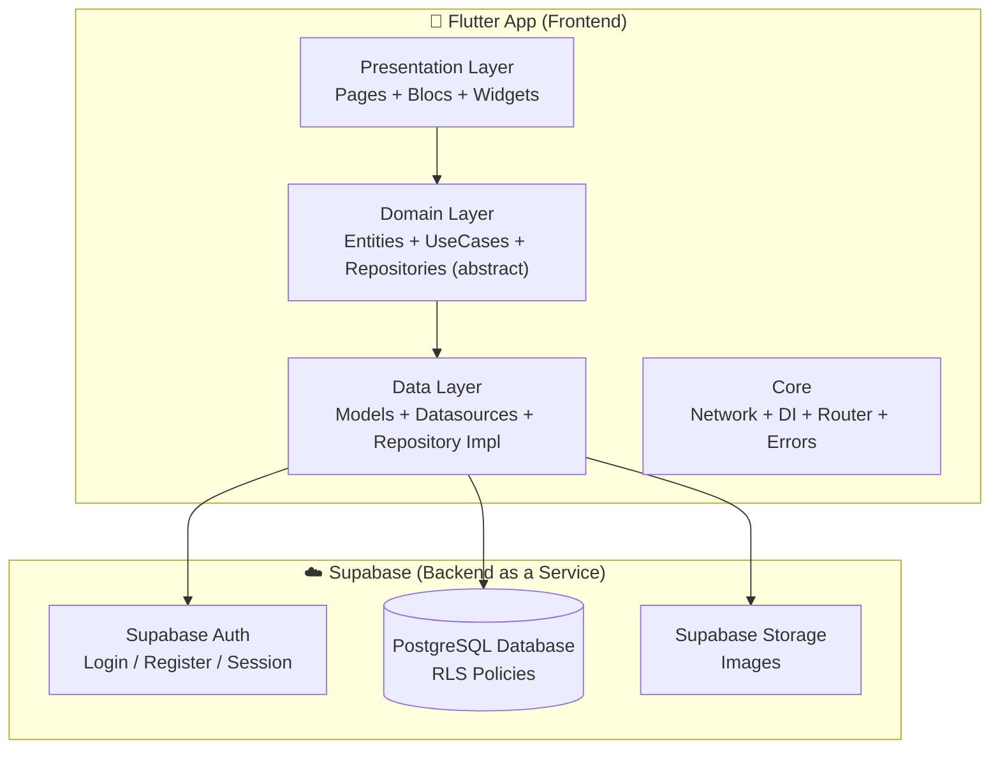

**FLUX D'AUTHENTIFICATION :** `Flutter → Supabase Auth (JWT) → SecureStorage`
**FLUX DONNÉES :** `Flutter → Supabase SDK (postgrest) → PostgreSQL`

---

## 3. DIAGRAMME DE L'ARCHITECTURE FLUTTER (CLEAN ARCHITECTURE)

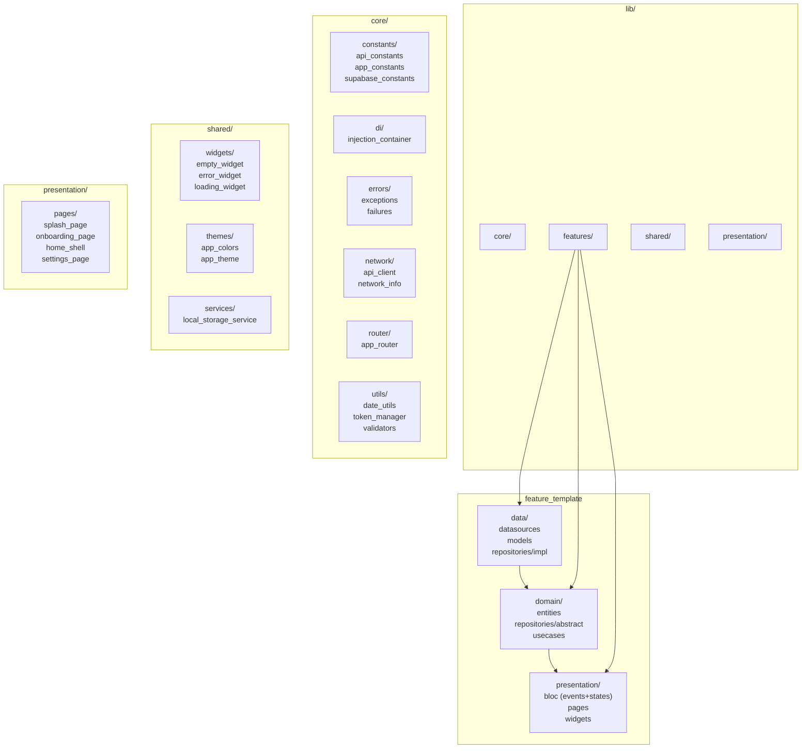

### Structure des features (8 modules)

```
lib/features/
├── auth/           ← Authentification (Login, Register, Forgot Password, Logout)
├── events/         ← Événements (CRUD, liste, détail, gestion, dashboard, favoris)
├── bookings/       ← Réservations (création, historique)
├── tickets/        ← Billets (liste, QR code, scanner)
├── payments/       ← Paiements (simulés, Stripe intent préparé)
├── notifications/  ← Notifications (liste, lecture)
├── profile/        ← Profil (affichage, édition)
└── admin/          ← Panneau d'administration (dashboard, utilisateurs, événements, réservations, tickets, analytics)
```

---

## 4. DIAGRAMME ENTITÉ-RELATION (FLUTTER)

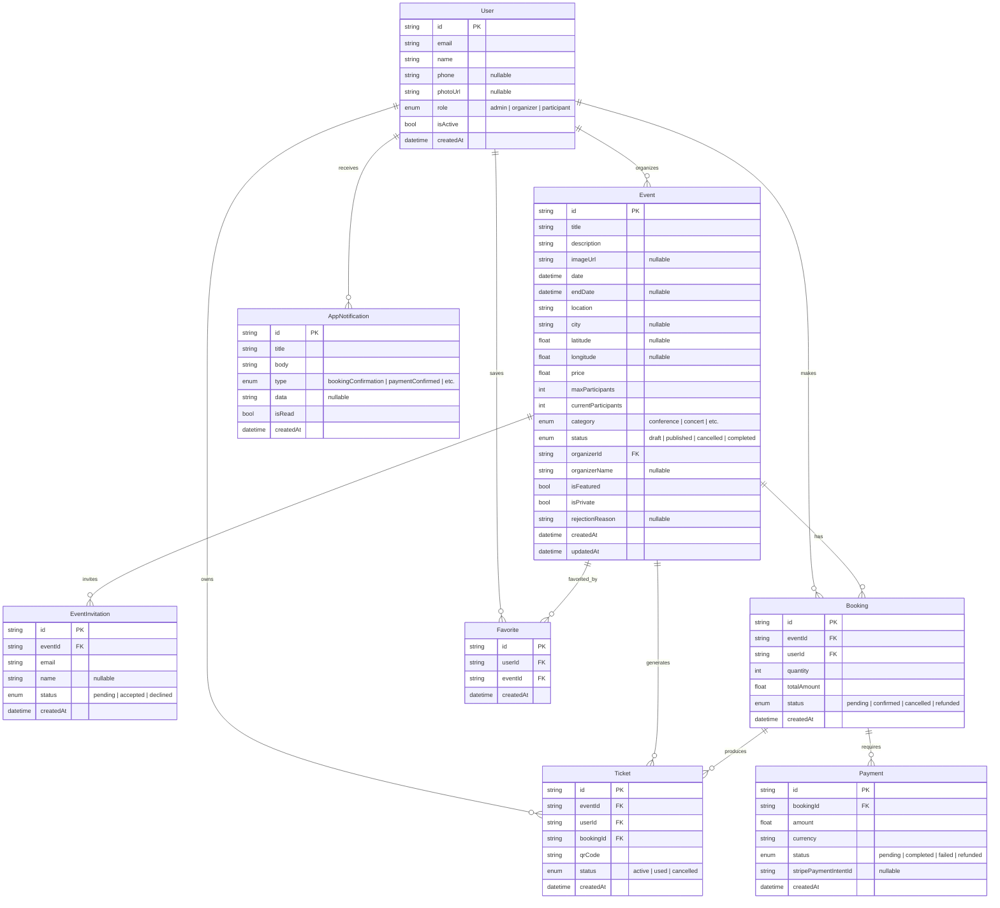

---

## 5. DIAGRAMME DE CLASSES UML — FRONTEND (FLUTTER)

```mermaid
classDiagram
    %% ── Core ────────────────────────────────────────────────
    class ApiConstants {
        <<static>>
        +String baseUrl
        +String auth
        +String login
        +String register
        +String events
        +String bookings
        +String tickets
        +String payments
        +String notifications
        +Duration connectTimeout
        +Duration receiveTimeout
    }

    class AppConstants {
        <<static>>
        +String localeKey
        +String themeModeKey
        +String jwtTokenKey
        +String onboardingKey
        +int minPasswordLength
        +int maxEventTitle
        +int maxEventDescription
        +int pageSize
    }

    class TokenManager {
        -FlutterSecureStorage storage
        +saveToken(String) Future~void~
        +getToken() Future~String?~
        +saveRefreshToken(String) Future~void~
        +getRefreshToken() Future~String?~
        +clearTokens() Future~void~
    }

    class ApiClient {
        -Dio dio
        -TokenManager tokenManager
        +get(String, Map?) Future~Response~
        +post(String, dynamic) Future~Response~
        +put(String, dynamic) Future~Response~
        +delete(String) Future~Response~
    }

    class NetworkInfo {
        <<abstract>>
        +isConnected() Future~bool~
    }
    class NetworkInfoImpl {
        -Connectivity connectivity
        +isConnected() Future~bool~
    }

    %% ── Failures ────────────────────────────────────────────
    class Failure {
        <<abstract>>
        +String message
    }
    class ServerFailure
    class CacheFailure
    class NetworkFailure
    class AuthFailure
    class ValidationFailure

    %% ── Domain Entities ─────────────────────────────────────
    class User {
        +String id
        +String email
        +String name
        +String? phone
        +String? photoUrl
        +UserRole role
        +DateTime? createdAt
    }
    class UserRole {
        <<enumeration>>
        admin
        organizer
        participant
    }

    class Event {
        +String id
        +String title
        +String description
        +String? imageUrl
        +DateTime date
        +DateTime? endDate
        +String location
        +String? city
        +double? lat/lng
        +double price
        +int maxParticipants
        +int currentParticipants
        +EventCategory category
        +EventStatus status
        +String organizerId
        +String? organizerName
        +bool isFeatured
        +bool isPrivate
        +String? rejectionReason
        +DateTime? createdAt
        +DateTime? updatedAt
        +isFree() bool
        +isFull() bool
        +isPast() bool
    }

    class EventInvitation {
        +String id
        +String eventId
        +String email
        +String name
        +InvitationStatus status
        +DateTime? createdAt
    }
    class InvitationStatus {
        <<enumeration>>
        pending, accepted, declined
    }
    class EventCategory {
        <<enumeration>>
        conference, concert, exhibition
        training, workshop, sports
        seminar, community
    }
    class EventStatus {
        <<enumeration>>
        draft, published
        cancelled, completed
    }

    class Booking {
        +String id
        +String eventId
        +String userId
        +String? eventTitle
        +String? eventImageUrl
        +DateTime? eventDate
        +String? eventLocation
        +int quantity
        +double totalAmount
        +BookingStatus status
        +DateTime? createdAt
    }
    class BookingStatus {
        <<enumeration>>
        pending, confirmed
        cancelled, refunded
    }

    class TicketValidationException {
        +String message
        <<exception>>
    }

    class Ticket {
        +String id
        +String eventId
        +String userId
        +String bookingId
        +String? eventTitle
        +String? eventDate
        +String? eventLocation
        +String qrCode
        +TicketStatus status
        +DateTime? createdAt
    }
    class TicketStatus {
        <<enumeration>>
        active, used, cancelled
    }

    class Payment {
        +String id
        +String bookingId
        +double amount
        +String currency
        +PaymentStatus status
        +String? stripePaymentIntentId
        +DateTime? createdAt
    }
    class PaymentStatus {
        <<enumeration>>
        pending, completed
        failed, refunded
    }

    class AppNotification {
        +String id
        +String title
        +String body
        +NotificationType type
        +String? data
        +bool isRead
        +DateTime? createdAt
    }
    class NotificationType {
        <<enumeration>>
        bookingConfirmation, paymentConfirmed
        eventCancelled, eventReminder, general
    }

    class Profile {
        +String id
        +String email
        +String name
        +String? phone
        +String? photoUrl
        +UserRole role
        +DateTime? createdAt
    }

    class DashboardStats {
        +int totalUsers
        +int totalEvents
        +int totalBookings
        +int totalTickets
        +double totalRevenue
    }

    %% ── Repository Interfaces ───────────────────────────────
    class AuthRepository {
        <<abstract>>
        +login(String, String) Future~Either~Failure, User~~
        +register(String, String, String, String) Future~Either~Failure, User~~
        +forgotPassword(String) Future~Either~Failure, void~~
        +logout() Future~Either~Failure, void~~
    }

    class EventRepository {
        <<abstract>>
        +getEvents(int, int, String?, String?, double?, double?, DateTime?) Future~Either~Failure, List~Event~~~
        +getEventById(String) Future~Either~Failure, Event~~
        +createEvent(Event) Future~Either~Failure, Event~~
        +updateEvent(Event) Future~Either~Failure, Event~~
        +deleteEvent(String) Future~Either~Failure, void~~
    }

    class BookingRepository {
        <<abstract>>
        +createBooking(String, int, double) Future~Either~Failure, Booking~~
        +getUserBookings() Future~Either~Failure, List~Booking~~
        +confirmBooking(String) Future~Either~Failure, void~~
        +cancelBooking(String) Future~Either~Failure, void~~
    }

    class TicketRepository {
        <<abstract>>
        +getUserTickets(String) Future~Either~Failure, List~Ticket~~
        +validateTicket(String, String) Future~Either~Failure, Ticket~~
    }

    class PaymentRepository {
        <<abstract>>
        +createPaymentIntent(double, String) Future~Either~Failure, String~~
        +confirmPayment(String) Future~Either~Failure, Payment~~
    }

    class NotificationRepository {
        <<abstract>>
        +getNotifications(String) Future~Either~Failure, List~AppNotification~~
    }

    class AdminRepository {
        <<abstract>>
        +getDashboardStats() Future~Either~Failure, DashboardStats~~
        +getUsers() Future~Either~Failure, List~Profile~~
        +updateUserRole(String, String) Future~Either~Failure, void~~
        +toggleUserActive(String) Future~Either~Failure, void~~
        +getAllEvents() Future~Either~Failure, List~Event~~
        +approveEvent(String) Future~Either~Failure, void~~
        +toggleEventFeatured(String) Future~Either~Failure, void~~
        +deleteEvent(String) Future~Either~Failure, void~~
        +getAllBookings() Future~Either~Failure, List~Booking~~
        +getAllTickets() Future~Either~Failure, List~Ticket~~
    }

    %% ── BLoCs ───────────────────────────────────────────────
    class AuthBloc {
        +LoginUseCase loginUseCase
        +RegisterUseCase registerUseCase
        +ForgotPasswordUseCase forgotPasswordUseCase
        +LogoutUseCase logoutUseCase
        +_onLogin(LoginEvent, Emitter) void
        +_onRegister(RegisterEvent, Emitter) void
        +_onForgotPassword(ForgotPasswordEvent, Emitter) void
        +_onLogout(LogoutEvent, Emitter) void
        +_onCheckAuth(CheckAuthEvent, Emitter) void
    }

    class EventBloc {
        +GetEventsUseCase getEventsUseCase
        +GetEventByIdUseCase getEventByIdUseCase
        +CreateEventUseCase createEventUseCase
        +UpdateEventUseCase updateEventUseCase
        +DeleteEventUseCase deleteEventUseCase
    }

    class BookingBloc {
        +CreateBookingUseCase createBookingUseCase
        +GetUserBookingsUseCase getUserBookingsUseCase
        +ConfirmBookingUseCase confirmBookingUseCase
        +CancelBookingUseCase cancelBookingUseCase
    }

    class TicketBloc {
        +GetUserTicketsUseCase getUserTicketsUseCase
        +ValidateTicketUseCase validateTicketUseCase
    }

    class PaymentBloc {
        +CreatePaymentIntentUseCase createPaymentIntentUseCase
        +ConfirmPaymentUseCase confirmPaymentUseCase
    }

    class NotificationBloc {
        +GetNotificationsUseCase getNotificationsUseCase
    }

    class ProfileBloc {
        +GetProfileUseCase getProfileUseCase
        +UpdateProfileUseCase updateProfileUseCase
    }

    class AdminBloc {
        +GetDashboardStatsUseCase getDashboardStatsUseCase
        +GetAllEventsUseCase getAllEventsUseCase
        +GetUsersUseCase getUsersUseCase
        +AdminRepository adminRepository
    }

    %% ── Use Cases ───────────────────────────────────────────
    class LoginUseCase {
        +call(String, String) Future~Either~Failure, User~~
    }
    class RegisterUseCase {
        +call(String, String, String, String) Future~Either~Failure, User~~
    }
    class CreateEventUseCase {
        +call(Event) Future~Either~Failure, Event~~
    }
    class ValidateTicketUseCase {
        +call(String) Future~Either~Failure, Ticket~~
    }

    %% ── Relations ───────────────────────────────────────────
    NetworkInfoImpl ..|> NetworkInfo
    Failure <|-- ServerFailure
    Failure <|-- CacheFailure
    Failure <|-- NetworkFailure
    Failure <|-- AuthFailure
    Failure <|-- ValidationFailure

    User --> UserRole
    Event --> EventCategory
    Event --> EventStatus
    Booking --> BookingStatus
    Ticket --> TicketStatus
    Payment --> PaymentStatus
    AppNotification --> NotificationType
    Profile --> UserRole

    AuthBloc --> LoginUseCase
    AuthBloc --> RegisterUseCase
    AuthBloc --> ForgotPasswordUseCase
    AuthBloc --> LogoutUseCase
    EventBloc --> GetEventByIdUseCase
    EventBloc --> GetEventsUseCase
    EventBloc --> CreateEventUseCase
    EventBloc --> UpdateEventUseCase
    EventBloc --> DeleteEventUseCase
    BookingBloc --> CreateBookingUseCase
    BookingBloc --> GetUserBookingsUseCase
    BookingBloc --> ConfirmBookingUseCase
    BookingBloc --> CancelBookingUseCase
    TicketBloc --> ValidateTicketUseCase
    TicketBloc --> GetUserTicketsUseCase
    PaymentBloc --> CreatePaymentIntentUseCase
    PaymentBloc --> ConfirmPaymentUseCase

    LoginUseCase --> AuthRepository
    RegisterUseCase --> AuthRepository
    CreateEventUseCase --> EventRepository
    ValidateTicketUseCase --> TicketRepository
    AdminBloc --> AdminRepository
```

---

## 6. MODÈLE CONCEPTUEL DE DONNÉES (MCD)

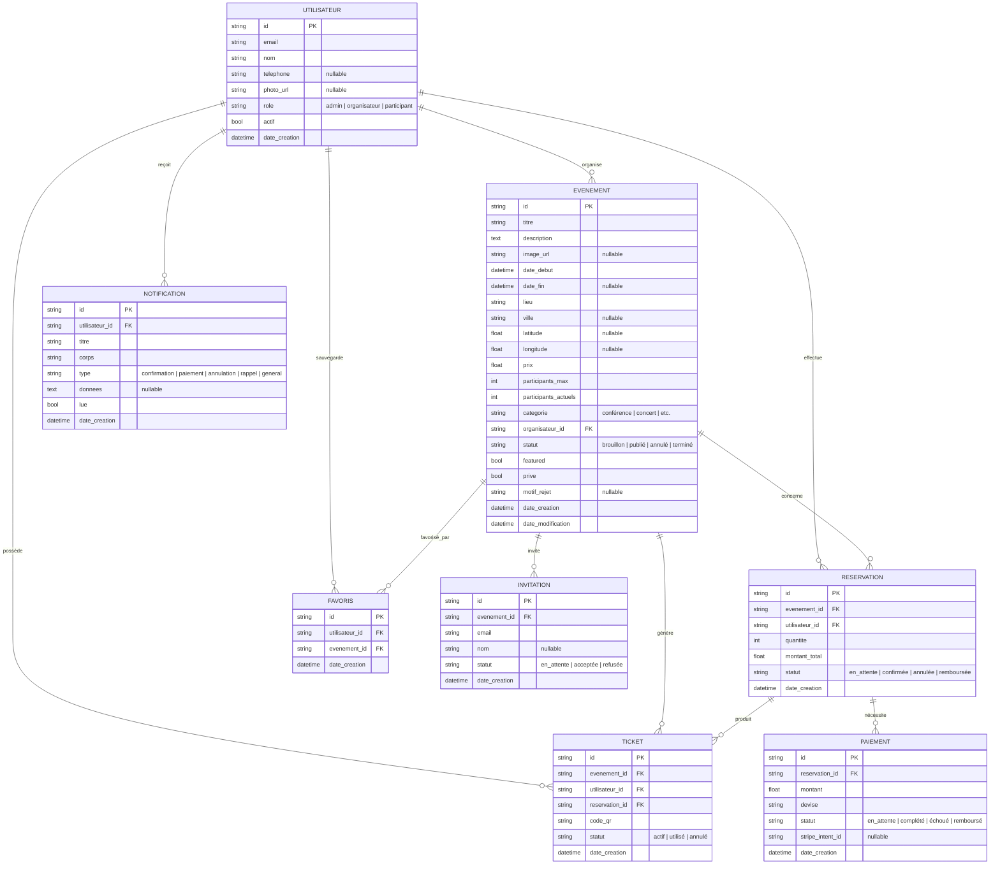

### Légende du MCD

| Symbole | Signification |
|---------|---------------|
| `||--o{` | 1 → N (un à plusieurs) |
| `id PK` | Clé primaire |
| `FK` | Clé étrangère |
| `?` | Optionnel (nullable) |

### Règles de gestion

| Règle | Description |
|-------|-------------|
| RG01 | Un **Utilisateur** a un profil intégré (table `profiles`, lié à Supabase Auth) |
| RG02 | Un **Utilisateur** peut organiser 0 ou plusieurs **Événements** |
| RG03 | Un **Utilisateur** peut effectuer 0 ou plusieurs **Réservations** |
| RG04 | Un **Utilisateur** peut posséder 0 ou plusieurs **Tickets** |
| RG05 | Un **Utilisateur** peut recevoir 0 ou plusieurs **Notifications** |
| RG06 | Un **Événement** a une **catégorie** (texte, pas de table dédiée) |
| RG07 | Un **Événement** peut avoir 0 ou plusieurs **Réservations** |
| RG08 | Un **Événement** peut générer 0 ou plusieurs **Tickets** |
| RG09 | Une **Réservation** nécessite 0 ou 1 **Paiement** |
| RG10 | Une **Réservation** produit 0 ou plusieurs **Tickets** |
| RG11 | Un **Ticket** ne peut être scanné qu'une seule fois (statut → USED) |
| RG12 | Un **Paiement** est obligatoire pour les événements payants (prix > 0) |
| RG13 | Un **Utilisateur** de rôle `organisateur` peut créer/modifier/supprimer ses événements |
| RG14 | Un **Utilisateur** de rôle `participant` peut réserver et annuler ses réservations |
| RG15 | Un **Utilisateur** peut ajouter/supprimer des **Favoris** |
| RG16 | Un **Utilisateur** de rôle `admin` a accès au panneau d'administration complet |
| RG17 | Un **Événement** peut être **public** (visible par tous) ou **privé** (visible uniquement par les invités) |
| RG18 | Un **Organisateur** peut inviter des personnes à un événement privé par email |
| RG19 | Un **Organisateur** peut importer une liste d'invitations depuis un fichier **CSV** |
| RG20 | Seules les personnes invitées peuvent réserver un événement privé |

---

## 7. DIAGRAMME DE NAVIGATION (GO ROUTER)

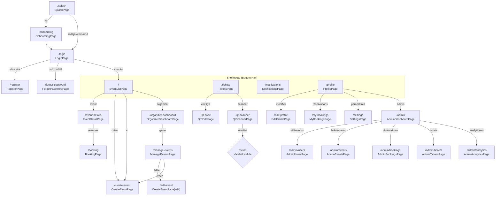

### Routes admin (6 pages)

| Route | Page |
|-------|------|
| `/admin` | AdminDashboardPage |
| `/admin/users` | AdminUsersPage |
| `/admin/events` | AdminEventsPage |
| `/admin/bookings` | AdminBookingsPage |
| `/admin/tickets` | AdminTicketsPage |
| `/admin/analytics` | AdminAnalyticsPage |

### Protection des routes

| Condition | Redirection |
|-----------|-------------|
| Non authentifié → route protégée | → `/login` |
| Authentifié → `/login`, `/register`, `/forgot-password`, `/splash`, `/onboarding` | → `/` |
| Non-admin → `/admin/*` | → `/` |
| Sinon | Route demandée |

---

## 8. DIAGRAMME DE SÉQUENCE — FLUX D'AUTHENTIFICATION

> **Backend :** Supabase Auth (JWT) — pas de serveur Spring Boot

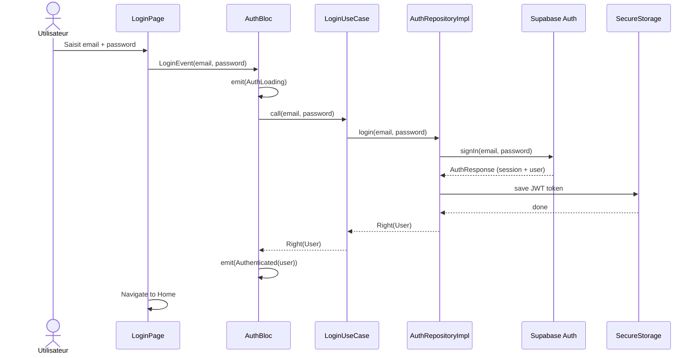

---

## 9. DIAGRAMME DE SÉQUENCE — FLUX QR CODE

> **Backend :** Supabase PostgreSQL (table `tickets`) — pas de serveur Spring Boot

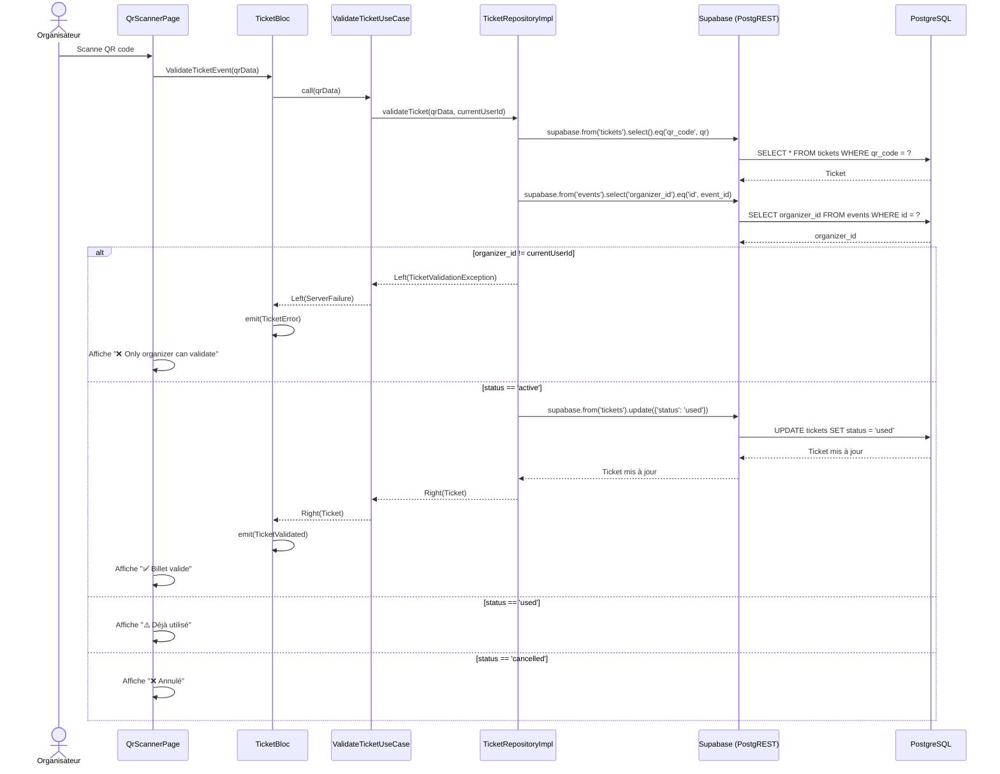

---

## 10. DIAGRAMME DE DÉPLOIEMENT

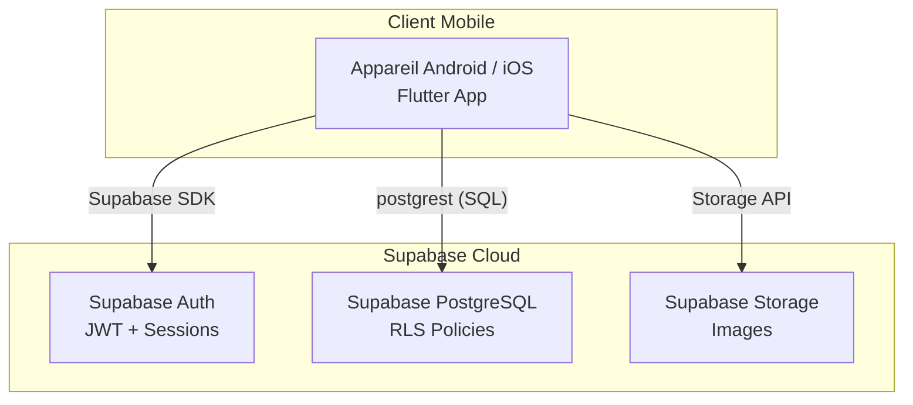

---

## 11. TABLEAUX DES ENDPOINTS API

> **Note :** Le projet utilise Supabase comme unique backend. Les endpoints ci-dessous sont fournis à titre de référence pour une éventuelle API REST mais ne sont pas implémentés dans le code actuel.

### Authentification

| Méthode | Path | Auth | Body | Réponse |
|---------|------|------|------|---------|
| `POST` | `/api/auth/register` | ❌ | `RegisterRequest` | `201` → `AuthResponse` (JWT + user) |
| `POST` | `/api/auth/login` | ❌ | `LoginRequest` | `200` → `AuthResponse` (JWT + user) |

### Catégories

| Méthode | Path | Auth | Body | Réponse |
|---------|------|------|------|---------|
| `GET` | `/api/categories` | ✅ | — | `200` → `List<Category>` |
| `POST` | `/api/categories` | ✅ | `CategoryRequest` | `201` → `Category` |

### Événements

| Méthode | Path | Rôle | Body | Réponse |
|---------|------|------|------|---------|
| `GET` | `/api/events` | ✅ Auth any | — | `200` → `List<EventResponse>` |
| `GET` | `/api/events/{id}` | ✅ Auth any | — | `200` → `EventResponse` |
| `POST` | `/api/events` | 🔒 ORGANIZER | `EventRequest` | `201` → `EventResponse` |
| `PUT` | `/api/events/{id}` | 🔒 ORGANIZER (owner) | `EventRequest` | `200` → `EventResponse` |
| `DELETE` | `/api/events/{id}` | 🔒 ORGANIZER (owner) | — | `204` No Content |

### Invitations (QR Code)

| Méthode | Path | Auth | Body | Réponse |
|---------|------|------|------|---------|
| `POST` | `/api/invitations` | ✅ | `InvitationRequest` | `201` → `InvitationResponse` |
| `GET` | `/api/invitations/my` | ✅ | — | `200` → `List<InvitationResponse>` |
| `POST` | `/api/invitations/verify` | ✅ | `QrVerifyRequest` | `200` → `{ message, status }` |

---

## 12. SCHÉMA DE LA BASE DE DONNÉES (PostgreSQL — Supabase)

Le schéma complet est défini dans `supabase_schema.sql` à la racine du projet. Il inclut les tables :

- `profiles` — utilisateurs (lié à Supabase Auth)
- `events` — événements avec RLS
- `bookings` — réservations
- `tickets` — billets avec QR codes
- `payments` — paiements
- `notifications` — notifications
- `event_invitations` — invitations aux événements privés
- `favorites` — favoris utilisateur/événement

Avec politiques Row Level Security (RLS) pour la sécurité au niveau ligne.

---

## 13. STACK TECHNIQUE

### Frontend (Flutter)

| Technologie | Version | Usage |
|-------------|---------|-------|
| Dart SDK | `^3.12.1` | Langage |
| `flutter_bloc` | `^8.1.6` | State management (BLoC pattern) |
| `bloc` | `^8.1.4` | Bloc core library |
| `go_router` | `^14.8.1` | Navigation avec guards |
| `supabase_flutter` | `^2.14.1` | SDK Supabase (Auth + Database + Storage) |
| `get_it` | `^8.3.0` | Injection de dépendances |
| `dartz` | `^0.10.1` | Functional (Either pour error handling) |
| `equatable` | `^2.0.8` | Value equality |
| `json_annotation` | `^4.12.0` | JSON serialization |
| `shared_preferences` | `^2.3.5` | Stockage local (thème, langue) |
| `hive` | `^2.2.3` | Base locale NoSQL |
| `hive_flutter` | `^1.1.0` | Flutter adapter Hive |
| `flutter_secure_storage` | `^9.2.4` | Stockage sécurisé JWT |
| `connectivity_plus` | `^6.1.5` | Vérification réseau |
| `qr_flutter` | `^4.1.0` | Génération QR code |
| `mobile_scanner` | `^6.0.11` | Scanner QR code (caméra) |
| `image_picker` | `^1.2.2` | Sélection photo |
| `cached_network_image` | `^3.4.1` | Cache images réseau |
| `lottie` | `^3.3.3` | Animations Lottie |
| `shimmer` | `^3.0.0` | Effet de chargement |
| `flutter_localizations` | SDK | Internationalisation |
| `intl` | `^0.20.2` | i18n + ARB files |
| `flutter_screenutil` | `^5.9.3` | Responsive design |
| `flutter_svg` | `^2.3.0` | SVG rendering |
| `share_plus` | `^12.0.2` | Partage d'événements |
| `path_provider` | `^2.1.5` | Chemins de fichiers système |
| `file_picker` | `^8.1.6` | Sélection de fichiers (import CSV) |
| `csv` | `^6.0.0` | Parsing de fichiers CSV pour import d'invitations |

### Backend

| Technologie | Usage |
|-------------|-------|
| Supabase Auth | Authentification (JWT) |
| Supabase PostgreSQL | Base de données avec Row Level Security |
| Supabase Storage | Stockage d'images |

### Tests

| Technologie | Type | Version |
|-------------|------|---------|
| `flutter_test` | Widget | SDK |
| `bloc_test` | Bloc | `^9.1.7` |
| `mocktail` | Mocking | `^1.0.5` |
| `flutter_lints` | Linting | `^6.0.0` |

---

## 14. DIAGRAMME DES ÉTATS BLOC

### AuthBloc

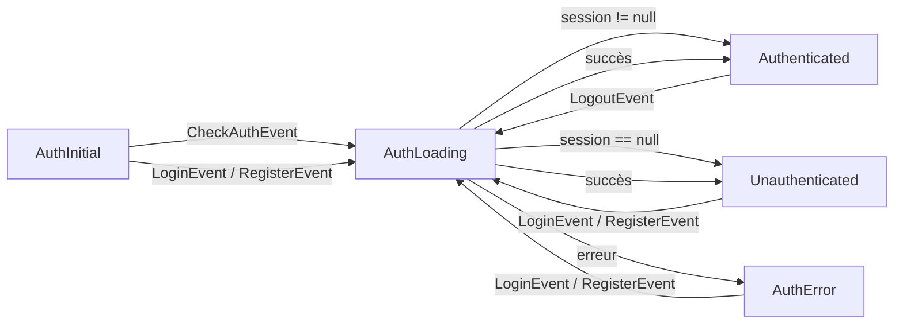

### EventBloc

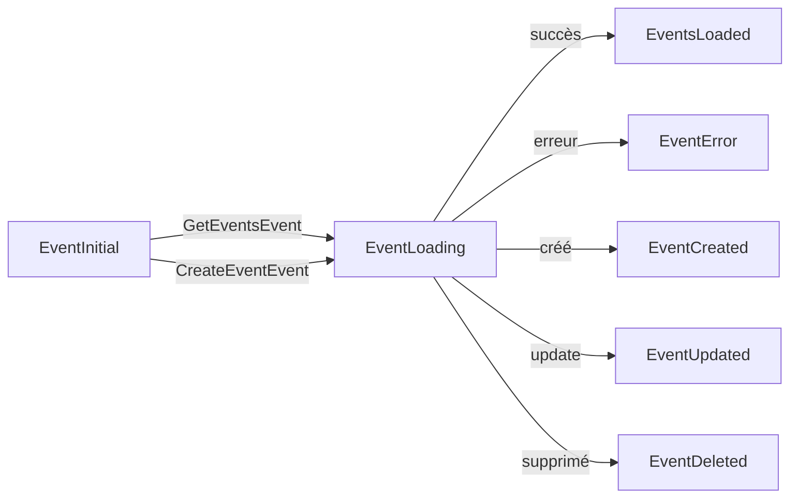

---

## 15. FICHIERS DE TRADUCTION (ARB)

| Clé | Anglais (`app_en.arb`) | Français (`app_fr.arb`) | Arabe (`app_ar.arb`) |
|-----|------------------------|-------------------------|----------------------|
| `app_name` | EventHub | EventHub | إيفنت هب |
| `login` | Login | Connexion | تسجيل الدخول |
| `register` | Register | S'inscrire | إنشاء حساب |
| `email` | Email | Email | البريد الإلكتروني |
| `password` | Password | Mot de passe | كلمة المرور |
| `events` | Events | Événements | الأحداث |
| `tickets` | Tickets | Billets | التذاكر |
| `notifications` | Notifications | Notifications | الإشعارات |
| `profile` | Profile | Profil | الملف الشخصي |
| *(total: 62+ clés par langue)* | | | |

---

## 16. SCHÉMA D'INJECTION DE DÉPENDANCES (GetIt)

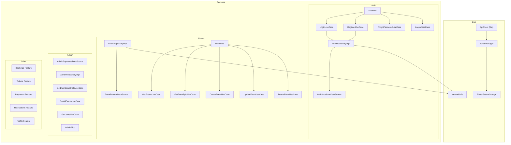

---

## 17. DÉPENDANCES ENTRE PACKAGES (FRONTEND)

```
main.dart
├── supabase_flutter (initialization)
├── get_it (DI container)
└── MultiBlocProvider (8 blocs)

core/
├── constants/       ← app_constants, supabase_constants
├── di/              ← injection_container (importe TOUS les blocs/repos/usecases)
├── errors/          ← exceptions, failures (utilisés par toutes les features)
├── network/         ← Supabase client, network_info (connectivity)
├── router/          ← app_router (importe toutes les pages, 25 routes)
└── utils/           ← date_utils, token_manager, validators

features/{feature}/
├── data/
│   ├── datasources/ ← Appelle Supabase (via supabase_flutter SDK)
│   ├── models/       ← JSON serialization
│   └── repositories/ ← Implémente l'interface domain
├── domain/
│   ├── entities/     ← Classes métier (extends Equatable)
│   ├── repositories/ ← Interfaces abstraites
│   └── usecases/     ← Appellent le repository
└── presentation/
    ├── bloc/         ← Bloc + Events + States
    ├── pages/        ← Screens Flutter
    └── widgets/      ← Composants réutilisables
```

---

## 18. COUVERTURE DE TESTS

| Feature | Type | Fichier | Tests |
|---------|------|---------|-------|
| ✅ Core | Unitaire | `network_info_test.dart` | 3 |
| ✅ Core | Unitaire | `date_utils_test.dart` | 4 |
| ✅ Core | Unitaire | `token_manager_test.dart` | 4 |
| ✅ Core | Unitaire | `validators_test.dart` | 20+ |
| ✅ Shared | Widget | `empty_widget_test.dart` | 3 |
| ✅ Shared | Widget | `error_widget_test.dart` | 3 |
| ✅ Shared | Widget | `loading_widget_test.dart` | 3 |
| ✅ Auth | Repository | `auth_repository_impl_test.dart` | 8 |
| ✅ Auth | UseCase | `login_usecase_test.dart` | 2 |
| ✅ Auth | UseCase | `register_usecase_test.dart` | 2 |
| ✅ Auth | UseCase | `forgot_password_usecase_test.dart` | 2 |
| ✅ Auth | Bloc | `auth_bloc_test.dart` | 5 |
| ✅ Auth | Widget | `login_page_test.dart` | 6 |
| ✅ Auth | Widget | `register_page_test.dart` | 4 |
| ✅ Auth | Widget | `forgot_password_page_test.dart` | 2 |
| ✅ Auth | Intégration | `login_flow_integration_test.dart` | 4 |
| ✅ Auth | Intégration | `register_flow_integration_test.dart` | 3 |
| ✅ Bookings | Bloc | `booking_bloc_test.dart` | 3 |
| ✅ Events | Bloc | `event_bloc_test.dart` | 5 |
| ✅ Events | Widget | `event_card_test.dart` | 7 |
| ✅ Admin | Bloc | `admin_bloc_test.dart` | 10 |
| ✅ General | Smoke | `widget_test.dart` | 1 |
| 🟡 Events | UseCase | 7 use cases non testés | **0 test** |
| 🟡 Bookings | UseCase | 2 use cases non testés | **0 test** |
| 🟡 Auth | Pages | Navigation post-auth manquante | — |
| ✅ Tickets | Repository + Bloc + Use Cases | `ticket_repository_impl_test.dart`, `ticket_bloc_test.dart`, etc. | 10 |
| ✅ Payments | Repository + Bloc + Use Cases | `payment_repository_impl_test.dart`, `payment_bloc_test.dart`, etc. | 8 |
| ✅ Profile | Bloc | `profile_bloc_test.dart` | 4 |
| ✅ Notifications | Bloc | `notification_bloc_test.dart` | 3 |
| ❌ Events | Pages | Pages événements non testées | **0 test** |
| ❌ Admin | Pages | Pages admin non testées | **0 test** |

---

## 19. SCHÉMA DE SÉCURITÉ

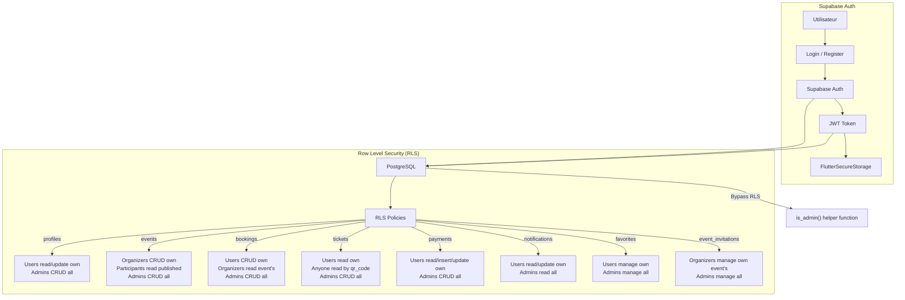

---

## 20. VARIABLES D'ENVIRONNEMENT / CONFIGURATION

```dart
// ===== Frontend (supabase_constants.dart) =====
static const String supabaseUrl = 'https://xxxxx.supabase.co';
static const String anonKey = '...';
```

Un fichier `.env.example` est fourni à la racine de `eventhub/` pour référence.

Les credentials peuvent être passés au build-time :

```bash
flutter run --dart-define=SUPABASE_URL=https://your-project.supabase.co \
            --dart-define=SUPABASE_ANON_KEY=your-anon-key
```

---

## 21. THÈME MATERIAL 3 — PALETTE DE COULEURS

```dart
static const Color primary   = Color(0xFF6C63FF);  // Violet (branding)
static const Color accent    = Color(0xFFFF6B35);  // Orange (CTA)
static const Color white     = Color(0xFFFFFFFF);
static const Color black     = Color(0xFF1A1A2E);  // Texte foncé
static const Color error     = Color(0xFFE53935);  // Rouge erreur
static const Color success   = Color(0xFF4CAF50);  // Vert succès
static const Color warning   = Color(0xFFFFC107);  // Jaune avertissement
static const Color surfaceLight = Color(0xFFF5F5F5);
static const Color surfaceDark  = Color(0xFF121212);
```

---

## 22. OBSERVATIONS ET NOTES

| # | Observation | Détail |
|---|-------------|--------|
| 1 | **Spring Boot supprimé** | Le backend Spring Boot a été retiré du projet. L'architecture est désormais 100% Flutter + Supabase. |
| 2 | **QR Codes** | `qr_flutter` pour l'affichage, `mobile_scanner` (v6.0.11) pour le scan. Les QR codes sont stockés en base Supabase. |
| 3 | **Paiements Stripe simulés** | Aucune intégration réelle du SDK Stripe. `createPaymentIntent()` insère juste une ligne en DB avec status `pending`. `confirmPayment()` met à jour le statut en DB. Pas de vrai PaymentIntent Stripe. |
| 4 | **Tests** | ~116 tests. Bonne couverture pour Core (27), Auth (25), Tickets (10), Admin (10), Events (17). Payments (8), Bookings (3), Profile (4), Notifications (3). |
| 5 | **CI/CD** | Pipeline GitHub Actions (`.github/workflows/ci.yml`) : Flutter 3.29.0 stable, `flutter analyze` + `flutter test`. Pas de cache SDK, pas de rapport de couverture, pas de matrix strategy (uniquement ubuntu-latest). |
| 6 | **Thème/Langue** | Persistés localement via `SharedPreferences`. Pas de synchro backend. |
| 7 | **Dashboard organisateur** | Statistiques calculées dynamiquement depuis les événements chargés côté client. |
| 8 | **Admin feature** | Panneau d'administration complet avec 6 pages. 7 méthodes du repository admin appelées directement depuis le BLoC (sans use case). |
| 9 | **Favoris** | Table `favorites` dans Supabase avec RLS. Toggle favori implémenté mais erreur silencieuse (failure → `null`, pas d'état d'erreur émis). |
| 10 | **Flux réservation → ticket** | Création automatique de ticket après booking (free) ou après paiement (paid). Navigation vers `/qr-code`. Validation organisateur-only pour le scan. |
| 11 | **Bugs connus** | Paiements simulés (pas de vrai Stripe). Validation email faible (`contains('@')`). 
| 12 | **Dead code** | ✅ `TokenManager`, `NetworkInfo` retirés du DI. `GetUserFavoriteIdsUseCase` injecté dans `EventBloc`. |
| 13 | **Contournements architecture** | ✅ `AuthBloc._onCheckAuth` utilise `GetCurrentUserUseCase`. ✅ `EventDetailPage` passe par le BLoC pour les favoris. ✅ `confirmPayment` filtre par `id` (plus par `booking_id`). |
| 14 | **Localisation** | Messages de validation dans les pages auth en dur en anglais (pas via l10n). 45+ clés par langue (EN/FR/AR). |
| 15 | **ApiConstants obsolète** | La classe `ApiConstants` dans le diagramme UML (section 5) est un vestige de l'ancienne architecture REST. Le projet utilise désormais le SDK Supabase direct. Les constantes réelles sont dans `app_constants.dart` et `supabase_constants.dart`. |
